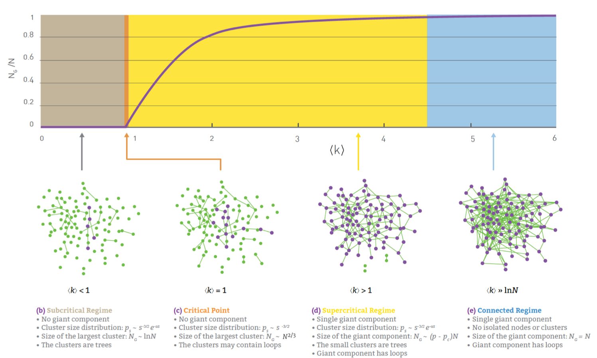
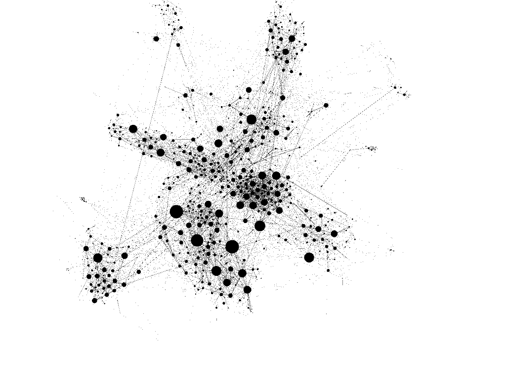
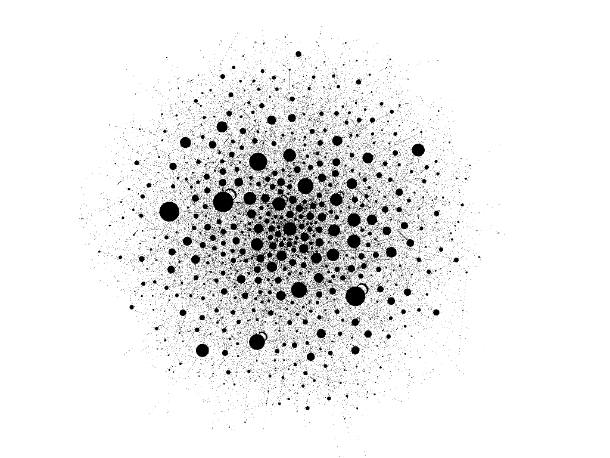
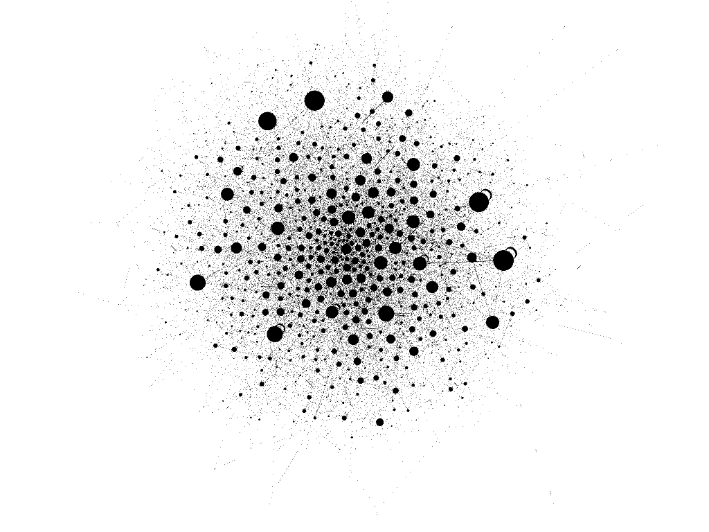
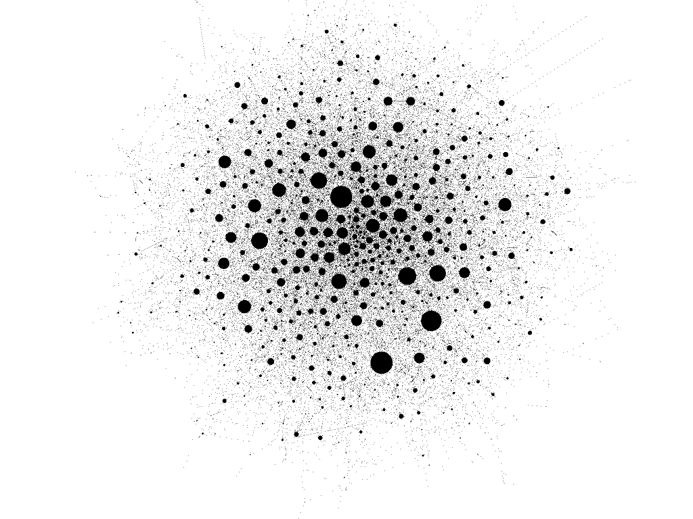

```{r setup, include=FALSE, echo=FALSE}
require("knitr")
opts_chunk$set(echo = TRUE)
library(igraph)
library(tibble)
# Optional, for including images of these types
library(jpeg) 
library(png)
# Utilities for plotting degree distributions 
source("Utility/degree_domain.R")
source("Utility/nonzero_degree_distribution.R")
```

____________________________________________________________
### Introduction 

In this analysis we examine how well three random graph models, namely 

* G(n,m) Random Graphs, igraph's sample_gnm
* Configuration model, igraph's sample_degseq
* Degree Preserving Randomization: igraph's rewire

model two example networks, namely EuroSiS WebAtlas and Internet Routers. We do so to understand what aspects of natural networks are captured well by random models, and what aspects require further explanation beyond random connectivity between vertices. We will speculate about some possible explanations that are motivated by our knowledge of these networked systems. 

____________________________________________________________
### Reading the networks

**EuroSiS WebAtlas** (which we will call WA), a graph of references between European web sites concerned with Science in Society, with N=1285 nodes and L=6462 links (sourced from https://gephi.org/users/ but no longer available): 

```{r}
WA <- read_graph("Networks/EuroSiS-WebAtlas-Simplified.graphml",
                 format="graphml")
WA$name <- "EuroSiS WebAtlas"
summary(WA)

```

**Internet Routers** (which we will call IR), a graph of connectivity between the same as of July 22, 2006, with N=22963 and L=48436, (sourced from http://www-personal.umich.edu/~mejn/netdata/):

```{r}
IR <- read_graph("Networks/internet_routers-22july06.graphml",
                 format="graphml")
IR$name <- "Internet Routers July 2006"
summary(IR)
```

____________________________________________________________
### 1. Prediction based on Random Graphs (10 pts)

Here we predict the connectivity of EuroSiS WebAtlas and Internet Routers based on the assumption that they are random graphs. If they depart from the prediction this tells us something about how they are not random.

#### (a) Average degree <k> and natural log of vertex count ln(|V|) 

```{r}
 WA.k   <- mean(degree(WA))
 WA.lnv <- log(gorder(WA))
 IR.k   <- mean(degree(IR))
 IR.lnv <- log(gorder(IR))
```

Metric                       | Value 
---------------------------- | -------------
EuroSiS WebAtlas \<k\>       | `r  WA.k`
EuroSiS WebAtlas ln(\|V\|)   | `r  WA.lnv`
Internet Routers \<k\>       | `r  IR.k`
Internet Rounters ln(\|V\|)  | `r  IR.lnv`

#### (b) Prediction of random regime and connectivity 

Based on Barabasi's discussion of the growth of a random graph, summarized below, we use the above values to predict the connectivity and component distributions of the above networks. 
```{r  echo=FALSE, fig.align="center", fig.cap = "Random Graph Recimes"}

```

**EuroSiS WebAtlas:** 
The mean degree is `r  WA.k`. Hence the random model predicts that it's probably a connected regime as the value of the mean degree is greater than the minimum threshold for a connected regime which starts at approximately 5.2. From this we predict that it is a fully connected. 

**Internet Routers:** 
The mean degree is `r  IR.k`. Hence the random model predicts that it's probably a super critical regime as the value of the mean degree is greater than the minimum threshold for a super critical regime which starts at approximately 3.8 but still less than the threshold for a connected regime. From this we predict that it is a mixture of small and a giant component. 

#### (c) Actual component size distribution 

**EuroSiS WebAtlas:**
```{r}
table(sapply(decompose(WA), vcount))
```

**Internet Routers:**

```{r}
table(sapply(decompose(IR), vcount))
```

#### (d) Match of prediction to actual connectivity 

**EuroSiS WebAtlas:**
The random model predicted that EuroSIS would be fully connected. The actual graph is a mixture of small and a giant component. This may be because in a real network, especially in terms of websites, there is always the scenario in which few websites don't reference or are referenced by other websites. The possibility that a few websites are outliers in that they don't talk to other websites is valid. 

**Internet Routers:**
The random model predicted a mixture of small and a giant component. The actual graph is fully connected. This may be because in a real network, routers must be fully connected in order for data to be transferred. Regardless of geological location, a user must connect to their immediate ISP router locally and then connect to the most efficient next router (i.e. neighbor, a different state over, a different country over). It does not make sense for a router to have a direct connection to a separate router via cable on the other side of the globe as it is not efficient and costly. Having all routers fully connected creates a scenario in which information processing and data transfers are efficient. You can actually view the location and number of router hops it takes to access a certain IP address by using the 
``` 
traceroute / tracert
```

command in your terminal or command prompt. 

____________________________________________________________
### 2. Analysis (30 pts, 15 per network)

#### (a) Construction of random models

In this section we construct G(n,m) and Configuration models for each network, and also perform Degree Preserving Randomization on them (which we expect to give similar results to the Configuration model, but is included to demonstrate an alternative method that preserves attributes).

**EuroSiS WebAtlas:**

G(n,m)
```{r}
 WA.gnm <- sample_gnm(vcount(WA), ecount(WA))
 WA.gnm$name <- paste("WA", WA.gnm$name)
 summary(WA.gnm)
```

Configuration Model 
```{r}
WA.config <- sample_degseq(degree(WA), method="simple")
WA.config$name <- paste("WA", WA.config$name)
summary(WA.config)
```

Degree Preserving Randomization
```{r}
WA.rewire <- rewire(WA, with=keeping_degseq(niter=ecount(WA)*1000))
WA.rewire$name <- "EuroSiS WebAtlas Rewired"
summary(WA.rewire)
```

**Internet Routers:**
```{r}
 IR.gnm <- sample_gnm(vcount(IR), ecount(IR))
 IR.gnm$name <- paste("IR", IR.gnm$name)
 summary(IR.gnm)
```

Configuration Model
```{r}
 IR.config <- sample_degseq(degree(IR), method="vl")
 IR.config$name <- paste("IR", IR.config$name)
 summary(IR.config)
```

Degree Preserving Randomization
```{r}
 IR.rewire <- rewire(IR, with=keeping_degseq(niter=ecount(IR)*1000))
 IR.rewire$name <- "Internet Routers Rewired"
 summary(IR.rewire)
```

#### (b) Scalar Metrics 

Below we compute and collect into tables the common metrics used to compare networks. 

**EuroSiS WebAtlas:**
```{r}
 WA.modelTitle <- c("EuroSIS WebAtlas Original", "G(n,m)", "Config", "Rewire")
 WA.models <- list(WA, WA.gnm, WA.config, WA.rewire) 
 
 WA.metrics <- tibble(
    
   Model               = WA.modelTitle,
   V                   = sapply(WA.models, vcount),
   E                   = sapply(WA.models, ecount),
   MeanDist            = sapply(WA.models, mean_distance), 
   Components          = sapply(WA.models, count_components),
   Transitivity        = sapply(WA.models, transitivity, type="global"),
   DegreeAssortativity = sapply(WA.models, assortativity_degree)
   
   )
 
 WA.metrics 
```

**Internet Routers:**
```{r}
 IR.modelTitle <- c("Internet Routers Original", "G(n,m)", "Config", "Rewire")
 IR.models <- list(IR, IR.gnm, IR.config, IR.rewire) 
 
 IR.metrics <- tibble(
    
   Model               = IR.modelTitle,
   V                   = sapply(IR.models, vcount),
   E                   = sapply(IR.models, ecount),
   MeanDist            = sapply(IR.models, mean_distance), 
   Components          = sapply(IR.models, count_components),
   Transitivity        = sapply(IR.models, transitivity, type="global"),
   DegreeAssortativity = sapply(IR.models, assortativity_degree)
   
   )
 
 IR.metrics 
```
#### (c) Degree Distributions 

**EuroSiS WebAtlas:**
```{r}
# Plot degree distributions of the natural network and of G(n,m) Use
# the degree domain adjustment and do not plot points with probability
# of 0.0. Linear axes will be OK for this one. 

plot(
     degree_domain(WA.gnm), 
     nonzero_degree_distribution(WA.gnm),
     main="EuroSiS WebAtlas with G(n,m), No Zeros", 
     xlab="k", 
     ylab="p(k)"
     )
```

**Internet Routers:**
```{r warning=FALSE}
plot(
     degree_domain(IR.gnm),
     nonzero_degree_distribution(IR.gnm),
     main="Internet Routers with G(n,m), No Zeros ", 
     xlab="k", 
     ylab="p(k)", 
     log="xy"
     )
```

#### (d) Discussion of results 

*Discuss how each model matches or fails to match the natural network, based on domain processes specific to the network being modeled. What is each type of graph model good at modeling? What might be operating in the natural network that each model does not capture?*

The EuroSIS WebAtlas model returned a graph that matches the network if it was random. However, we are dealing with a natural network. According to the textbook, a heuristic to use is that a graph that follows a visible bell curve like standard deviation probably points to a Poisson. For the WebAtlas, it seems that websites follows this distribution. Although the network is natural, it somewhat follows principles of a random network. Very cool. 

The Internet Routers model returned a graph that matches the network if it was a natural network. According to the textbook, a heuristic to use is that a graph that follows a visible downward trend that resembles a straight line towards the tail of the graph probably points to a scale free network. It seems that because internet routers are fully connected, there are several routers that are more popular than expected which is shown by the tail of the graph. Therefore, internet routers probably follow the power law. 


____________________________________________________________
### 3. Visualization and Interpretation - 10 pts

In this section we visualize the models for EuroSiS WebAtlas in Gephi, and interpret these visualizations to reinforce and add to the conclusions reached above. 

#### (a) Writing out models as graphml 

```{r}

write_graph(WA.gnm,    file = "Networks/WA_gnm.graphml",    format = "graphml")
write_graph(WA.config, file = "Networks/WA_config.graphml", format = "graphml")
write_graph(WA.rewire, file = "Networks/WA_rewire.graphml", format = "graphml")
```

#### (b) Visualizations 

We have run identical visualization procedures on all 4 networks (the natural networks and the 3 random models), as follows: 

Node color set to black. 
Node size set to ranking by degree (min: 1, max: 400).
Node layout set to ForceAtlas2 (Approximate Repulsion On, Scaling 5.0, Gravity 5.0, LinLog mode On, Prevent Overlap On).

Or view the settings [here](https://cdn.discordapp.com/attachments/796217015849189377/944725328515981372/unknown.png).

**EuroSiS WebAtlas Natural Network**
```{r  echo=FALSE, fig.align="center", fig.cap = "EuroSiS WebAtlas Natural Network"}
 
```

**EuroSiS WebAtlas G(n,m)**
```{r  echo=FALSE, fig.align="center", fig.cap = "EuroSiS WebAtlas G(n,m)"}
 
```

**EuroSiS WebAtlas Configuration Model**
```{r  echo=FALSE, fig.align="center", fig.cap = "EuroSiS WebAtlas Configuration Model"}
 
```


**EuroSiS WebAtlas Degree Preserving Randomization**
```{r  echo=FALSE, fig.align="center", fig.cap = "EuroSiS WebAtlas Rewired"}
 
```

#### (c) Discussion 

*Discuss how the visualizations show the difference between the graph models (referencing the visualized node degrees, connectivity, and clustering).*

At first glance, the first visualization, the original EuroSiS WebAtlas, provides more visual information. There seems to be roughly 8 distinct node clusters that are immediately visible. This could indicate that in the natural network, there are certain clusters or groups that websites tend to interact with more than others. Perhaps they are owned by the same parent company? Whatever the case, the first graph has strong distinct features when viewing the data through ForceAtlas2. 

Interestingly, the other 3 graphs (i.e. G(n,m), Config, Rewire), doesn't seem to have multiple clusters as the original graph. You can infer that because the graphs themselves seems like one giant cluster (component), where there aren't notable specific clusters, the G(n,m), Config, and Rewire probably follows a random network's tendency where nodes have roughly the same degrees. You could plot the 3 graphs as we did in question 2c and perhaps view another standard deviation like bell curve for the degree distribution. 

The only other thing I can immediately notice is that the G(n,m) and Configuration Model has visible self loops for a handful of nodes (about 5). Even so, they are usually one of the largest nodes present in their respective graphs. 
