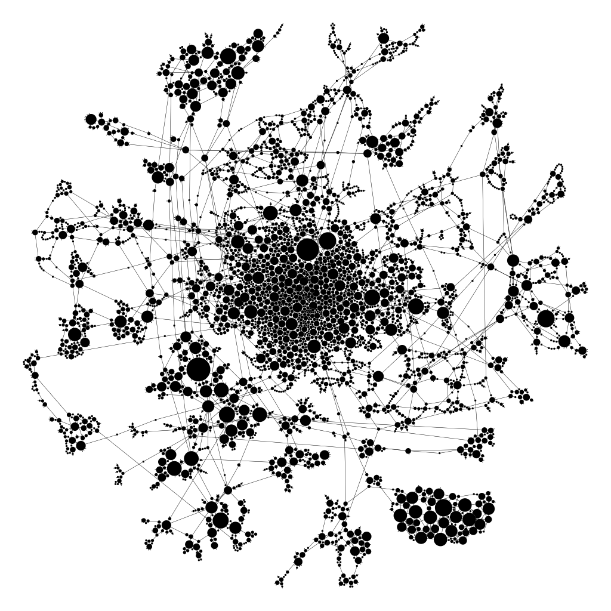

```{r setup, include=FALSE, echo=FALSE}
require("knitr")
opts_chunk$set(echo = TRUE)
library(igraph)
library(tibble) 
# For including images of these types
library(jpeg) 
library(png)
# Utility for plotting degree distributions 
source("Utility/degree_domain.R")
```

____________________________________________________________
### Introduction 

In this document we analyze natural networks through plotting degree distributions, fitting distributions to the power law, and modeling with preferential attachment models. The objective is to identify real world processes and constraints that may have generated the networks. 

____________________________________________________________
### Part A. Analyzing and Interpreting the Structure of a Real World Network

In this section, we use our analytic toolkit to characterize a natural network. 

____________________________________________________________
#### Western States Power Grid 

Below we read in an undirected unweighted representation of the topology of the Western States Power Grid of the United States, compiled by Duncan Watts and Steven Strogatz. The network was taken from the web site of Prof. Watts at Columbia University (http://cdg.columbia.edu/cdg/datasets, but this site is no longer available). It was used as one example in: D. J. Watts and S. H. Strogatz, "Collective dynamics of `small-world' networks", Nature 393, 440-442 (1998). We presume that the nodes are major generators and distribution centers and the edges are the physical power lines connecting them, often over long distances at great expense.

```{r}
PG <- read_graph("Networks/power_grid.gml", format="gml")
summary(PG)
```


____________________________________________________________
#### 1. Network Visualization (5 pts)

**(a)** A full network visualization generated in Gephi is available in: Images/q1a.png. The layout algorithm used was ForceAtlas 2 with LinLog mode and set Gravity to make it sufficiently spread out that one can see the structure but not so spread out that it makes poor use of the space available A lower resolution version is reproduced below. 

```{r  echo=FALSE, fig.align="center", fig.cap = "Western States Power Grid"}
 
```


**(b)** Discussion of salient feature(s): 

  When visualizing a power grid, I would use mnemonics to determne salient features. In the visualization above, the graph has a huge cluster of nodes with smaller clusters surrounding it. If we compared it to the Western States of the United States, I would assume the center would represent a densely populated area such as a major state with a popular city (i.e. California: Los Angeles, San Fransisco) whilst the clusters surrounding it would represent other states with not as much population density (i.e. Utah). The smaller clusters usually have 2 to 3 additional ways of connecting to other clusters, which would suggest that it represents power line redundancies in case the connecting lines to the main grid fails. They have 2-3 other lines that allows them to connect to the grid. The super outliers could also just be suburban/rural areas as well, not necessarily representing states. 


____________________________________________________________
#### 2. Configuration Model and Metrics (8 pts)

**(a)** We construct a configuration model for this network in order to help us assess which metric features may be due to degree sequence alone rather than other wiring constraints. The Viger-Latapy method is used to provide a simple undirected graph. 

```{r}
PG.config <- sample_degseq(degree(PG), method="vl")
summary(PG.config)
```

**(b)** Standard metrics are computed on and compared between the configuration model and the natural network below. 

Mean degree and log(|V|) enable us to compare to random graph regimes: 

```{r}
# Mean Degree and log(|V|) is the same for both networks, so we 
# only need one table. I recommend using tibble. 

PG.metrics <- tibble (
  
  MeanDegree = mean(degree(PG.config)),
  "log|V|" = log(vcount(PG))
)

PG.metrics
```

Other metrics enable us to compare the natural network to the configuration model: 

```{r}
# Display global transitivity, degree correlation, and mean distance
# in a table with each row labeled. You can make a tibble for each row, 
# and then combine them with add_row for display. 

PG.metrics1 <- tibble (
  
  "Global Transitivity PG" = transitivity(PG, type="global"),
  "Global Transitivity PG.config" = transitivity(PG.config, type="global")
)

PG.metrics2 <- tibble (
  
  "Degree Correlation PG" = assortativity_degree(PG, directed = FALSE),
  "Degree Correlation PG.config" = assortativity_degree(PG.config, directed = FALSE)
)

PG.metrics3 <- tibble (
  
  "Mean Distance PG" = mean_distance(PG, directed = FALSE),
  "Mean Distance PG.config" = mean_distance(PG.config, directed=FALSE)
)
  
PG.metrics1
PG.metrics2
PG.metrics3

```

A table of component sizes verifies that the natural network is connected: 

```{r}
# Frequency table of component sizes (no tibble needed, just use table)

table(components(PG.config)$csize)
      
```

____________________________________________________________
#### 3. Degree Distribution (4 pts)

Linear binned and cumulative plots of degree distribution are provided below, along with minimum and maximum degree. 

```{r warning=FALSE}
# Plot degree distribution with linear binning
# Include legend with k-min and k-max 
# Plot cumulative degree distribution 


quickplot1 <- function(g, main= "PG Linear Binning", cumulative=FALSE) {
 plot(degree_domain(g), degree_distribution(g),
       log="xy", xlab="k", ylab="p(k)",
       main=main)
}

quickplot2 <- function(g, main="PG Cumulative", cumulative=TRUE) {
  plot(degree_domain(g), degree_distribution(g, cumulative = cumulative),
       log="xy", xlab="k", ylab="p(k)",
       main=main)
}

plfit_legend <- function(g) {
  g.plfit <- fit_power_law(degree(g), implementation="plfit")
  legend("bottomleft", bty="n", cex=1.2,
         c(paste("kmin =", min(degree(g))),
           paste("kmax =", max(degree(g)))
         ))
}

quickplot1(PG)
plfit_legend(PG)

quickplot2(PG)
plfit_legend(PG)


```

____________________________________________________________
#### 4. Fitting to Power Law (5 pts)

The results of fit_power_law are provided below. 
```{r}
as_tibble(PG.plfit <- fit_power_law(degree(PG), implementation="plfit"))
```

These results show that _________.  We can set xmin to __________ showing that ____________:  

```{r}
as_tibble(PG.plfit <- fit_power_law(degree(PG), implementation="plfit", xmin=1)) 
```

The original tibble shows that the power law fits for xmin = 10. For the second tibble, we show that using xmin = 1 instead of 10 that the probability of fitting a power law drops to 0. 

____________________________________________________________
#### 5. Discussion (8 pts)

**(a) Connectivity:** Comparing mean degree ```r round(mean(degree(PG)), 1)``` to log(|V|) ```r round(log(vcount(PG)), 1)```, we see that the G(n,m) random model (Barabasi Figure 3.7) predicts Supercritical Regime, obviously different from the power grid. This difference can be attributed to random network models predicting that isolated nodes and tiny components observed for small <k> collapse into a giant component through a phase transition. The power grid should be a giant component that is fully connected.  

**(b) Mean distance:** The G(n,m) random model predicts a mean distance of 8.687886, while the power grid has a mean distances of 18.98919. Also examining the configuration model, we can see that the difference is explained by few long paths as the model is not fully connected. 

**(c) Transitivity and Small Degree Saturation:** Compared to the random models, the power grid has really high transitivity and not so much small degree saturation. This difference results from the power grid showing that some areas probably has a higher population density than other areas. In our case, a certain city in a popular state, (i.e. LA) would have a clear higher population density than another city from the same state (i.e. Tustin), this could suggest why there is a disparity.  

**(d) Higher Degree Distribution:** Considering that typical gamma values for scale free networks range from 2.1 to 3.2 (Newman, 2010, Table 8.1), following Barabasi's formula 4.18 we would expect a network of size ```r vcount(PG)``` to have hubs approximately every 50 nodes. In the Power Grid network we see the hubs are present. We can make sense of this if we consider that power grids have central access points, aka those big weird tesla coil looking mini factories in some locations like Kalihi where you can actually see the power grinds sort of stem from. Then the power lines connect from there to places where they need electricity. I don't believe that we have 1 central hub and everyone connects to the power lines, but more like multiple hubs where power lines stem from where we can connect to.  

____________________________________________________________
### Part B. Modeling the Degree Distribution of a Real World Network 

In this section, we model the degree distribution of a natural network with variations of the Preferential Attachment model, with particular attention paid to what features of the degree distribution are predicted by domain processes, and whether we can replicate observed featurs with Preferential Attachment variants. 

____________________________________________________________
#### High-Energy Physics Citation Network 

Below we read in a graph of citations in the High Energy Physics theory arXiv from January 1993 to April 2003. If a paper i cites paper j, the graph contains a directed edge from i to j. Thus, in-degree indicates how many other papers chose to cite a given paper over time, while out-degree indicates how many papers a given paper cites at publication time. We analyze these distributions separately as they are driven by distinct processes, as discussed below. 

```{r}
HEP <- read_graph("Networks/cit-HepTh.gml", format="gml")
summary(HEP)
```
____________________________________________________________
#### 6. Discussion of Domain Processes (12 pts)

For each of the following, we consider whether or not domain processes are expected to exhibit growth, preference of attachment based on degree, nonlinearity in this preference of attachment, initial appeal, and/or preferences sensitive to aging. 

**(a) In-Degree (being cited):** 

Growth for in-degrees make sense because in random network models, we assume that the number of nodes N is fixed. Obviously, paper citations since 1993 to 2003 means that for each year, there is more nodes added to the network. Growth processes continuously increase N.Preferential Attachment also makes sense because papers will usually cite each others work if they are working in the same area of interest and because it is a real network, there are papers that will be more popular than others that are cited. 
For nonlinearity in this preference of attachment, I would expect it to follow the Linear Regime of (alpha = 1) because it must follow a power law based on these domain processes as a real network. Fitness for sure makes sense because in Barabasi 6.3 they mention that while most research papers acquire only a few citations, a small number of publications collect thousand and even tens of thousands of citations. Initial Appeal or attractiveness obvious can play a role because it doesn't make sense where there could be an academic journal where it has no connections with. You can argue that two papers that are new that have no unique citations still have a chance of citing each other if they are related in the same topic. To allow unconnceted nodes to acquire links we add a constant to the preferential attachment. Citation based on age, not that it means that because your paper is old, other papers WILL cite you, it's more like the probability is higher for papers to cite you because your old, there is no guarantee. 

**(b) Out-Degree (citing others):** 

*(Replace this with a discussion of growth, preference of attachment based on out-degree, nonlinearity in this preference of attachment, initial appeal, and/or preferences sensitive to aging.)*


Growth, I'm not sure if growth would affect out-degree as much because once a paper is written with that current eras citations, new papers that come out next year won't really be cited in the old work. Preference of attachment, definitely because if a paper is written, there must have been a paper written prior that was objectively more popular which you also probably cited. Nonlinearity in this preference of attachment, similar to in-degree I think because the network is real it probably will follow the power law and therefore be another Linear Regime of (alpha = 1). Fitness: High fitness nodes are rare but not impossible. Because we assume it's a real network and therefore follows a power law, there must be some instance of fitness that would influence the out-degree of citation  nodes. Initial Appeal: Citations that are more grounded in research and more popular will have a higher weight in initial appeal. If your paper is on a similar topic you are more likely to cite them. Aging definitely because of the above explanation, if a certain citation is more popular, it had more time to marinate and be popular. Therefore you're more likely to cite them. 


**(c) Applicability of Preferential Attachment Models:** Given the above discussion, we expect that a preferential attachment model is a plausible model for **in-degree** because it makes sense that because higher-degree nodes (people citing you), have more visibility hence why others will most likely link to you. We expect that a preferential attachment model is also a plausible model for **out-degree** because other papers that have higher visibility makes you more like to connect to them. 

____________________________________________________________
#### 7. HEP Degree Distributions and Metrics (12 pts)

**(a) Degree Distribution Plots**

Linear binned and cumulative plots of each degree distribution are provided below, along with minimum and maximum degree and fit to power law. 

In-degree: 

```{r warning=FALSE}
# Plot in-degree distribution with linear binning 
# Add a legend with k-min and k-max
# Plot cumulative in-degree distribution
# Add a legend with fit_power_law parameters xmin, alpha, KS.p and KS.stat

plot(degree_domain(HEP, mode="in"),
     degree_distribution(HEP, mode="in"),
     log="xy", xlab="k", ylab="p(k)",
     main="HEP In-Degree")


quickplot3 <- function(g, main=g$name, cumulative=TRUE) {
  plot(degree_domain(g, mode="in"), degree_distribution(g, mode="in", cumulative = cumulative),
       log="xy", xlab="k", ylab="p(k)",
       main="HEP In-Degree Cumulative")
}

plfit_legend <- function(g) {
  g.plfit <- fit_power_law(degree(g), implementation="plfit")
  legend("bottomleft", bty="n", cex=1.2,
         c(paste("kmin =", min(degree(g))),
           paste("kmax =", max(degree(g))),
           paste("kmean =", mean(degree(g)))
         ))
}

quickplot3(HEP)
plfit_legend(HEP)

```

Out-degree: 

```{r warning=FALSE}
# Plot out-degree distribution with linear binning 
# Add a legend with k-min and k-max
# Plot cumulative out-degree distribution
# Add a legend with fit_power_law parameters xmin, alpha, KS.p and KS.stat

plot(degree_domain(HEP, mode="out"),
     degree_distribution(HEP, mode="out"),
     log="xy", xlab="k", ylab="p(k)",
     main="HEP Out-Degree")

quickplot4 <- function(g, main=g$name, cumulative=TRUE) {
  plot(degree_domain(g, mode="out"), degree_distribution(g, mode="out", cumulative = cumulative),
       log="xy", xlab="k", ylab="p(k)",
       main="HEP Out-Degree Cumulative")
}

plfit_legend <- function(g) {
  g.plfit <- fit_power_law(degree(g), implementation="plfit")
  legend("bottomleft", bty="n", cex=1.2,
         c(paste("xmin =", g.plfit$xmin),
           paste("alpha =", g.plfit$alpha),
           paste("KS.p =", g.plfit$KS.p),
           paste("KS.stat =", g.plfit$KS.stat)
         ))
}

quickplot4(HEP)
plfit_legend(HEP)
```

**(b) Proposed Explanations of Observed In-Degree Distribution:** 

Growth must be present because the nodes are not fixed and throughout the years we see a more papers being added to the network. The top most nodes in the figure would indicate the most recent papers because they are cited less and the bottom most nodes are cited the most. This would correlate with the other domain processes such as aging, preference of attachment, and initial appeal. This is also attributed to the fact that the most cited in-degree nodes are at the end of the graph and there is a large disparity of thickness meaning that each of these domain processes are playing a role in making sure the popular papers stay popular. The super critical regime and fitness however is hard to interpret. I believe this is due to my inexperience with theoretical graph analysis but I would suggest that with my experience, I am not able to determine if they exist. 

**(c) Proposed Explanations of Observed Out-Degree Distribution:** 

Similarly, the out-degree graph follows a similar graph visualization. I would suggest similar domain processes acting in this scenario as well. Growth seems to be present because as the network grows, the least cited papers will usually be the newest ones on the top left. This would then tie in to explaining why aging, preference of attachment, and initial appeal also influences the out-degree nodes because as papers are older, they have had more time for papers to cite to. In the case of some node, you are more likely to cite other works if they are older, has more citations prior (popular nodes), and has some initial appeal because a lot of other papers cite that particular paper. Similarly, I don't have enough experience to see how fitness or super critical regime would exist from this graph other than the fact it looks like a figure barbasi chapter 6 would show so that is my own limitation. 

____________________________________________________________
#### 8. Fitting a Preferential Attachment Model (13 pts)

After experimentation with the nonlinear preference of attachment, aging, and initial appeal parameters of igraph's sample_pa_age, the following model is proposed as the best fit. 

**(a) Model and Degree Distribution Plots and Metrics:** 

The Model: 

```{r}
# Provide the sample_pa_age code that generates your best model. 
# Print a table of parameters m, attachment preference, initial
# attractiveness, and aging. Again, tibbles make nice ouput.

HEP.pa <- sample_pa_age(vcount(HEP), 
                        pa.exp = 1,
                        m = ecount(HEP)/vcount(HEP),
                        aging.exp = -1.5,
                        out.pref = FALSE,
                        directed = TRUE,
                        zero.deg.appeal = 50,
                        zero.age.appeal = 1.5,
                        deg.coef = 1.5,
                        age.coef = 1.5,
                        time.window = NULL)

HEP.pa$name <- "BA Model for HEP"


```

Plots and Metrics: 

```{r warning=FALSE}
# Plot in-degree distribution with linear binning 
# Add a legend with k-min and k-max
# Plot cumulative in-degree distribution
# Add a legend with fit_power_law parameters xmin, alpha, KS.p and KS.stat


plot(degree_domain(HEP.pa, mode="in"),
     degree_distribution(HEP.pa, mode="in"),
     log="xy", xlab="k", ylab="p(k)",
     main=HEP.pa$name)
```

**(b) Summary of What Worked and What Did Not:*** 

The preferential attachment exponent chosen was 1 based on the lectures. Aging can't be positive so that is why I chose -1.5. We usually stayed within 1-2 for the other parameters because you don't want to edit the visualization too much with large variables. The numbers we settled on was also attributed from trial and error. For zero.deg.appeal, we wanted to give them more attractiveness with vertices with no adjacent edges so that is why I chose a larger number (i.e. 50). 

____________________________________________________________
#### 9. Interpretation (8 pts)

Here we discuss how the above model further informs our understanding of processes in the HEP domain, beyond what we could guess before attempting the preferential attachment model. 

**(a) Nonlinear preference of attachment:** 

I think the graph is sublinear in that although it follows a downwards trend, papers that are cited would be exponentially more cited as new papers arrive as they have all these attractions to that paper. Although I chose pa.exp = 1, it still has that curve to it. Perhaps that pa.exp = 1 would suggest that the graph is most likely "linear" and neither super or sub-linear. 

**(b) Initial Attractiveness:** 

Initial Attractiveness makes sense in citation papers as papers that have been cited more are usually more credible. This is the initial attractiveness a paper gives off to others. It's more like, why wouldn't you connect with a highly credible source? The zero.degree.appeal was selected at 50 because it seemed like a good match for the visualization fit. 

**(c) Aging:** 

This is obvious in that older papers are more likely to have more in-degree connections as they have had more time to be connected to. In my previous explanation, there is no way an older paper can cite a new paper but a new paper can cite a previous work. This alone would cause disparity and show that an older aged paper would have more in-degree connections. For our visualization, you can assume quite accurately that the nodes presented at the top left are usually newer which means it would take a while for papers to start citing it. However, new papers would cite previous popular papers because enough time has passed for readers to provide peer review and cite that source as credible. 

**(d) Combined Conclusions:** 

The barabasi model for HEP has shown favor for several degree domain processes. In our observation, we can identify that the model graph has a preference to be linear for the nonlinear preference of attachment. In addition, there exists some form of initial attractiveness that makes new papers gravitate towards popular older papers. These may be because these papers are older, so there is more time for new work to cite them, or the fact that a lot of readers agree with the work, citing to them as credible, therefore being considered credible as the general consensus. If I had more experience, I might be able to detect whether fitness played a crucial role in the shape of the visualization but as of right now, these are the domain processes that exist in our barabasi model graph. 

____________________________________________________________
Pau 

