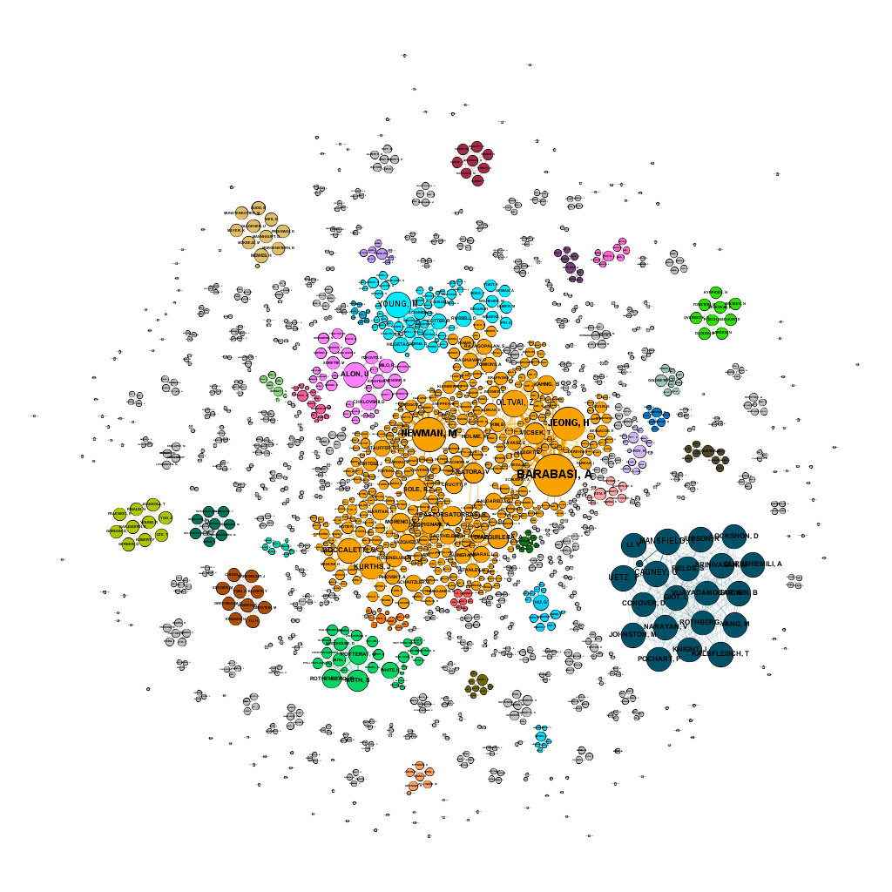

```{r setup, include=FALSE, echo=FALSE}
require("knitr")
opts_chunk$set(echo = TRUE)
library(igraph)
library(tibble)
# Optional, for including images of these types
library(jpeg) 
library(png)
# Utilities
source("Utility/topnv.R")
```

____________________________________________________________
### Part A: Centrality Metrics

In this section we compare various centrality metrics computed in both igraph and Gephi, and demonstrate their application. 

____________________________________________________________
#### 1. Computing and Inspecting Centralities in igraph (6 pts)

The demonstration uses a weighted undirected graph we will call NS in which vertices represent authors of papers on Network Science, and edges represent co-authorship relations. Edge weights represent the sum of collaboration credit for all the papers the pair co-authored. The collaboration credit per pair of authors on a single paper is 1/(n-1) where n is the number of authors. For example, if there is 1 co-author, the link to that co-author is credited 1/1; if there are 2 co-authors, the link to each is credited 1/2, etc.

```{r}
NS <- read.graph("Networks/netscience.graphml", format="graphml")
summary(NS) 
```

Selected degree-based centrality metrics (unweighted and weighted) are computed below and added to NS as vertex attributes.

```{r}
# Unweighted Degree
 V(NS)$i_degree       <- degree(NS, mode="all")

# Weighted Degree
 V(NS)$i_strength     <- strength(NS)

# Unweighted Eigenvector Centrality
 V(NS)$i_eigen_cent_u <- eigen_centrality(NS, weights=NA)$vector

# Weighted Eigenvector Centrality
 V(NS)$i_eigen_cent_w <- eigen_centrality(NS, weights=E(NS)$weight)$vector

# Unweighted Page Rank
 V(NS)$i_page_rank_u  <- page_rank(NS, directed = FALSE, weights=NA)$vector

# Weighted Page Rank
 V(NS)$i_page_rank_w  <- page_rank(NS, directed = FALSE, weights=E(NS)$weight)$vector

# Check that they are all there and none came out v/x 
summary(NS)
```

Since path-based metrics interpret weights as distances, edge weights w indicating closeness are converted to distances d with formula d = 1 + max(w) - w. Histograms demonstrate the change in distribution.  

```{r}
# The original distribution. 
hist(E(NS)$weight, breaks=64)
# Edge weights converted to distances for path-based centralities 

ew <- E(NS)$weight
nw <- (max(ew) + 1) - ew 
E(NS)$distance <- nw
hist(E(NS)$distance, breaks=64)
```

Selected path-based centrality metrics (unweighted and weighted by distances) are computed below and added to NS as vertex attributes.

```{r}
# Normalized Unweighted Betweenness
 V(NS)$i_between_u    <- betweenness(NS, weights=NA, normalized=TRUE)

# Normalized Weighted Betweenness using distances
 V(NS)$i_between_w    <- betweenness(NS, normalized = TRUE, weights=1/E(NS)$weight)

# Normalized Unweighted Closeness
 V(NS)$i_closeness_u  <- closeness(NS, weights=NA, normalized=TRUE)

# Normalized Weighted Closeness using distances
 V(NS)$i_closeness_w  <- closeness(NS, normalized = TRUE, weights=1/E(NS)$weight)

# Check that they are all there.
summary(NS)
```

____________________________________________________________
#### 2. Computing and Visualizing Centralities in Gephi (6 pts)

The above results are written out for inspection in Gephi. 

```{r}
write_graph(NS, "netscience-with-metrics.graphml", format="graphml")
```

##### (a) Computing Centrality Metrics in Gephi (4 pts) 

The following node-level metrics were computed in Gephi with the indicated adjustments: 
* Eigenvector centrality: 1000 iterations
```
Network Interpretation: undirected
Number of iterations: 1000
Sum change: 0.002190069336513044
```

* Page Rank: unweighted with epsilon 0.0001 or 1.0E-5 
```
Epsilon = 1.0E-5
Probability = 0.85
```

* Betweenness and Closeness: normalized

```
Diameter: 17
Radius: 0
Average Path length: 5.82323968635486
```

##### (b) Visualizing the Network in Gephi (2 pts) 

The graph is visualized as follows: 

```{r  echo=FALSE, fig.align="center", fig.cap = "Netscience With Metrics Graph"}
 
```

The resulting Gephi project may be found in: 
```
Networks/Park-Analysis-5-Centrality-Metrics.gephi
```
____________________________________________________________
#### 3. Comparing Gephi and igraph results (18 pts)

We compare selected results between Gephi and igraph below, also taking into account the difference between weighted and unweighted results, to understand differences in how each platform computes these metrics. 

##### (a) Gephi's and igraph's Eigenvector centralities 

**How they differ:** 
If we observe the data laboratory provided by gephi, we see noticeable distinction of eigenvector centrality values across all 3 data subsets. For the values pertaining to i_eigen_cent_u, it seems that it considers UETZ, CAGNEY, and MANSFIELD as nodes with the most influence in an unweighted graph at 1.0. 

This listing corresponds with gephi's eigenvector centrality where they also consider UETZ, CAGNEY, and MANSFIELD as the nodes with the most influence to other nodes with high influences at 1.0.

However, this isn't the case of i_eigen_cent_w, where if weighted, the greatest node is considered to be BARABASI. Which makes sense visually. BARABASI is the biggest physical node because it has the most connections when sized by degree. Interestingly enough, UETZ, CAGNEY, and MANSFIELD are valued at 0.0. 

**Why they differ:** 

For i_eigen_cent_u, it must be that UETZ, CAGNEY, and MANSFIELD have the most degree/connections from other nodes when the eigenvector of the dataset is analyzed as unweighted and it seems that the subsequent connections from UETZ, CAGNEY, and MANSFIELD also have high degree connections. This makes sense as UETZ, CAGNEY, and MANSFIELD pertain to their own cluster (blue colored in the graph), and the edge connections are dense.

This must mean that Eigenvector Centrality is calculating the unweighted graph value such as i_eigen_cent_u. This is noticeable as the values between Eigenvector Centrality and i_eigen_cent_u have similar values when your sort them by descending order. However, i_eigen_cent_u ends its evaluation when the value is below 0.10 as BARABASI, the next value in the sort listed, is considered 0.0 whilst Eigenvector Centrality values BARABASI at 0.064204. 

For i_eigen_cent_w it is obvious that it differs because it is the only category that considers eigenvectors with weighted values. i_eigen_cent_w  doesn't consider degrees and strength as although they're correlated, because you have to remember that eigenvectors also depends on the nodes they connect to and how high their influence is to other nodes. 

**Which we prefer for what purposes:** 

I would consider the weighted values to be the most accurate in realistic portrayals of node influence. The unweighted values would only pertain to specific clusters. The graph itself has many smaller connected components therefore the unweighted values prefers to show the greatest nodes of influence within specific clusters. The weighted values such as Barabasi applies to the entire graph as a whole. The entire graph has the most influence from Barabasi, but within each individual cluster, UETZ, CAGNEY, and MANSFIELD have the most influence. 

**Additional Comments:** 

I couldn't seem to find an explanation using the math metrics of eigenvectors. 

##### (b) Gephi's and igraph's Closeness centralities

**How they differ:** 

The values between i_closeness_u and i_closeness_w are almost 1:1 with +/- 0.000001 if there are any disparities. The top 3 are NEWMAN, PASTORSATOR, and HOLME with the value of 0.000825. 

For closeness centrality, the labels are the same with the previous question in that, UETZ, CAGNEY, and MANSFIELD return as the top 3 with a value of 1.0. 

**Why they differ:** 

The seem to differ in that i_closeness_u and i_closeness_w are returning the same values but they apply to the entire graph. These top 3 nodes that return as the highest closeness are nodes that are the most central in the entire graph. The gephi closeness however seems to addressing individual clusters again with the reemergence of the nodes mentioned above, UETZ, CAGNEY, and MANSFIELD which lie in the same blue colored cluster. 

**Which we prefer for what purposes:** 

For this particular scenario, you would consider igraphs interpretation of closeness as NEWMAN would be accurate in the portrayal of the most central node of a graph. If you wanted specific cluster data then go with gephi's interpretation. 

**Additional Comments:** 

I believe it makes sense as the blue cluster for UETZ, CAGNEY, and MANSFIELD has physically huge nodes and a lot of edges visually. The calculations are confirmed when looking at the graph that the blue cluster which contains the 3 nodes mentioned above would be considered the most close within the specific cluster. 

##### (c) Gephi's and igraph's Betweenness centralities

**How they differ:** 

i_between_u and betweeness centrality from gephi have the exact same values. This indicates that the gephi interpretation prefers the unweighted caluclation for betweenness centrality for nodes. On the other side, i_between_w from igraph is obviously different because it calculates the betweeness of nodes if the weight values are considered in the calculations. 

The difference between the actual values seem to be about +/- 0.0002 for some nodes or completely the same for other nodes. Interestingly, all 3 categories seem to agree that NEWMAN has the most influence over the flow of information in the graph. This would indicate that NEWMAN perhaps serves as a bridge in addition to being a huge influence in closeness as well. In addition, the top influencers all belong to the yellow cluster from the graph or whom I like to call, the big dogs (i.e. NEWMAN, VESPIGNANT, BARABASI, SOLE, MORENO, BOCCALETTI). They all belong to the same cluster of authors as well.

**Why they differ:** 

The only difference is the calculation between unweighted and weighted. All three of the categories by igraph and gephi point to the same nodes from the same cluster as the top influencers. The slight difference is when the weights are considered where the unweighted graphs prefer nodes that influence the most as bridges in general whereas the weighted graphs takes what was said previously but also considers that BARBASI has the most edges and the highest degree which takes precedent over generality. 

**Which we prefer for what purposes:** 

We would prefer the undirected graphs if we were looking for the most influential node from the main super cluster whilst the weighted graph would reveal the node with the most influence from the super cluster, PLUS the most degrees and overall connectivity. Personally, the weighted graph in this scenario is the most correct as BARABASI must have the highest influence being the biggest node. 

**Additional Comments:** 

I was wondering if the calculations for significant digits are off between i_between and i_closeness as one is 1:1 but the other is off by 0.000001. But I would need to read the documentation to figure that out. 

____________________________________________________________
#### 4. Comparing the Centrality Metrics to each other (20 pts)

Using Network Science as a test case, we compare igraph's versions of the metrics to each other to understand their different meanings. In order to minimize confounding variables we use normalized values where applicable, and only use weights in the first item below. 

##### a. Comparing Degree and Weighted Degree

Gephi and igraph give identical results on degree and weighted degree: there are no choices to make concerning how to compute these metrics, so we only computed them in igraph.

**How they differ:** 

The top 10 under each metric are below. 
```{r}
(tibble(
    igraph = topnv(NS, degree(NS))$label,
    igraphValues = c("34", "27", "27", "21", "20", "20", "20", "20", "19", "19"),
    gephi = c("BARABASI, A", "NEWMAN, M", "PASTORSATORRAS, R", "VESPIGNANI, A", "SOLE, R", "MORENO, Y", "BOCCALETTI, S", "LATORA, V", "KURTHS, J", "VAZQUEZ, A"),
    gephiValues = c("29.999986827373505","22.99999088048935","17.999990731477737","16.999985992908478","15.000001907348633","15.00000111758709","14.999992042779922","12.999997839331627","11.999997973442078","11.0000069886446")
)) 
```

igraph and gephi returned different values. Notably, igraph considers BARABASI, JEONG, and NEWMAN as the leading influential nodes in terms of degree (i.e., 34, 27, 27 respectively) but gephi considers BARBASI, NEWMAN, and PASTORSATORRAS as the leading influential nodes in terms of degree (i.e., 29, 22, 17 respectively). 

**Explanation and Significance:** 

Obviously, the discrepancy is due to igraph considering the non-weighted degree whilst gephi does. If the degree calculations doesn't consider the weights but strictly by the degree, it is obvious that BARABASI, NEWMAN, and JEONG would be classified as the nodes that are the most influential as they have the most connections to other nodes. In this case, we should consider the weights because they show the scope of influence goes deeper than surface level influence. If you consider the weights, the top 3 ranking of influential nodes by weighted degree is BARABASI, NEWMAN, and PASTORSATORRAS. By this interpretation we can assume that the gephi data is more practically accurate because it indicates that these top 3 nodes are not only influential in the amount of connections/edges it has but also influential in the adjacent edges for each vertex. 

##### b. Comparing Degree and Eigenvector Centrality (unweighted)

**How they differ:** 

The top 10 under each metric are below. 
```{r}
(tibble(
    Degree = topnv(NS, degree(NS))$label,
    DegreeValues = c("34", "27", "27", "21", "20", "20", "20", "20", "19", "19"),
    EigenvectorCentrality = c("UETZ, P", "CAGNEY, G", "MANSFIELD, T", "GIOT, L", "JUDSON, R", "KNIGHT, J", "LOCKSHON, D", "NARAYAN, V", "SRINIVASAN, M", "POCHART, P"),
    EigenValues = c("1.0", "1.0", "1.0", "0.9920885152666923", "0.9920885152666923", "0.9920885152666923", "0.9920885152666923", "0.9920885152666923", "0.9920885152666923", "0.9920885152666923")
))

```

The degree values measures significance based on a range between 0-100 whilst Eigen values measure significance based on a range between 0-1. The only similar labels between each measurement are UETZ, CAGNEY, and MANSFIELD. 

**Explanation and Significance:** 

As stated previously in question 3, we can see that the degree values are based on the entire graph as a whole, therefore it makes sense how it considers BARABASI, JEONG, and NEWMAN as the top influencing nodes from the entire graph (yellow cluster). If we want to consider the nodes of the most eigen influence between the smaller subset of clusters than it makes sense how UETZ, CAGNEY, and MANSFIELD are considered the top influencers of their specific cluster (blue cluster). 

##### c. Comparing Eigenvector Centrality and Page Rank (unweighted)

**How they differ:** 

The top 10 under each metric are below. 

```{r}
(tibble(
    EigenvectorCentrality = c("UETZ, P", "CAGNEY, G", "MANSFIELD, T", "GIOT, L", "JUDSON, R", "KNIGHT, J", "LOCKSHON, D", "NARAYAN, V", "SRINIVASAN, M", "POCHART, P"),
    EigenValues = c("1.0", "1.0", "1.0", "0.9920885152666923", "0.9920885152666923", "0.9920885152666923", "0.9920885152666923", "0.9920885152666923", "0.9920885152666923", "0.9920885152666923"),
    PageRank = c("NEWMAN, M", "BARABASI, A", "JEONG, H", "SOLE, R", "YOUNG, M", "BOCCALETTI, S", "OLTVAI, Z", "DIAZGUILERA, A", "PASTORSATORRAS, R", "STAUFFER, D"),
    PageRankValues = c("0.0041289861501326", "0.00372241536568701", "0.00276349596753571", "0.00235647438133194", "0.0023418669289327", "0.00227765115190074", "0.00213957627508923", "0.00196907459332634", "0.00195780958647908", "0.00193720272377773")
)) 
```

The differences visable in this table is that we are comparing Eigenvector centrality and page rank. Eigen vector has a range between 0-1 and Page Rank uses (1/infity) - 0. When we consider the top influential nodes in this comparison we see that Eigenvector prefers UETZ, CAGNEY, and MANSFIELD, whilst PageRank prefers NEWMAN, BARABASI, and JEONG like our previous degree value analysis. 

**Explanation and Significance:** 

Eigenvector Centrality is calculating the nodes with most influence considering all individual clusters in the graph whilst pagerank looks for the most influential node within the entire graph which is why all top 10 nodes from page rank all belong to the yellow cluster of authors. The yellow cluster of authors are the most influential in general whilst UETZ, CAGNEY, and MANSFIELD are authors that are most influential within the blue cluster. This would indicate there are more connections within the blue cluster than there is in the yellow cluster. Page rank in general is calculating the amount of hyperlinks to these authors which makes sense as NEWMAN, BARABASI, and JEONG are referenced the most, but on the other hand, Eigen only cares about transitive influence so that is why we see the blue clusters shinning above the rest again. 

##### d. Comparing Page Rank and Betweenness (unweighted)

**How they differ:** 

The top 10 under each metric are below. 
```{r}
(tibble(
    PageRank = c("NEWMAN, M", "BARABASI, A", "JEONG, H", "SOLE, R", "YOUNG, M", "BOCCALETTI, S", "OLTVAI, Z", "DIAZGUILERA, A", "PASTORSATORRAS, R", "STAUFFER, D"),
    PageRankValues = c("0.0041289861501326", "0.00372241536568701", "0.00276349596753571", "0.00235647438133194", "0.0023418669289327", "0.00227765115190074", "0.00213957627508923", "0.00196907459332634", "0.00195780958647908", "0.00193720272377773"),
    Betweenness = c("NEWMAN, M", "PASTORSATORRAS, R", "MORENO, Y", "SOLE, R", "BOCCALETTI, S", "JEONG, H", "HOLME, P", "CALDARELLI, G", "BIANCONI, G", "CAPOCCI, A"),
    BetweennessValue = c("0.0224593751134588", "0.0195168613816262", "0.0161734321121478", "0.0152767561352667", "0.0144435503199008", "0.0141721405443252", "0.0130992178875928", "0.012527805884243", "0.00988873645097517", "0.00987789056154081")
)) 
```

PageRank considers NEWMAN, BARBASI, and JEONG as the top 3 influencers whilst Betweeness considers NEWMAN, PASTOR, and MORENO as the top 3 influencers. 
The range values are the same in that it's between (1/infity) - 0.

**Explanation and Significance:** 

Obviously, page rank is considering that NEWMAN, BARABASI, and JEONG have the most influence because it's ranking web content based on hyperlinks that are referencing these authors. Therefore, it must be that they are of importance. On the other hand, Betweeness is considering that NEWMAN, PASTOR, and MORENO are arguably more influential because it seems that their influence over the flow of information in general is outweighing everyone else. It could be that they are acting as bridges to a lot more nodes. Both of these calculations seem to agree that NEWMaN has the biggest influence. 

____________________________________________________________
#### 5. Conclusions about Network Science Authors (6 pts)

Now that we understand the meaning of the metrics, we apply them to draw conclusions about the roles of the most prominent researchers in this data set. The discussion is based on the following metric rankings (we now use weights to reflect strength of collaboration): 

```{r}
(tibble(
    Degree = topnv(NS, degree(NS))$label,
    DegreeValues = c("34", "27", "27", "21", "20", "20", "20", "20", "19", "19"),
    DegreeWeighted = c("BARABASI, A", "NEWMAN, M", "PASTORSATORRAS, R", "VESPIGNANI, A", "SOLE, R", "MORENO, Y", "BOCCALETTI, S", "LATORA, V", "KURTHS, J", "VAZQUEZ, A"),
    DegreeWeightedValues = c("29.999986827373505","22.99999088048935","17.999990731477737","16.999985992908478","15.000001907348633","15.00000111758709","14.999992042779922","12.999997839331627","11.999997973442078","11.0000069886446"),
    PageRankWeighted = c("BARABASI, A", "NEWMAN, M", "SOLE, R", "JEONG, H", "PASTORSATORRAS, R", "YOUNG, M", "BOCCALETTI, S", "VESPIGNANI, A", "MORENO, Y", "KURTHS, J"), 
    PageWeightedValues = c("0.00536698725025176", "0.00528428923714018", "0.00323414519336146", "0.00310970970294569", "0.00296298967048661", "0.0028276970572222", "0.00277106345871376", "0.00272449931261297", "0.0026520489211386", "0.00257658727350858"),
    Betweenness = c("NEWMAN, M", "VESPIGNANI, A", "PASTORSATORRAS, R", "BARABASI, A", "SOLE, R", "MORENO, Y", "BOCCALETTI, S", "CALDARELLI, G", "STAUFFER, D", "CAPOCCI, A"),
    BetweennessValue = c("0.0243988864181424", "0.0242104060224843", "0.0200376484630317", "0.0194547480394071", "0.018165938933939", "0.0166823006194855", "0.0147350666651853", "0.0136384414298163", "0.0110675688330405", "0.0105080796585608")
)) 

```

What the table above shows is that there are two authors who are considered the top most influential. Considering that each category attempts to explain influence based on their own specific definition (i.e., degree count, page link references, bridges), it is interesting that 2 authors are notable considered the influential across the board. They are BARABASI (top 1, 4 times), and NEWMAN (1x top 1, 2x top 2, 1x top 3). The implications of this means that the general consensus across all different types of measures suggest BARABASI is by far the most influential. This is supported visually when you consider that BARABASI is the biggest node physically when you go back to question 2b, visualization. NEWMAN is also the second biggest node physically. Interestingly, BARBASI and NEWMAN are both within the same yellow cluster and they share a lot of work which is probably why they are somewhat tied for top influential.  
 
____________________________________________________________
### Reciprocity, Transitivity and Subgraph Extraction

In this section we illustrate two applications of reciprocity and transitivity. First, we interpret reciprocity and transitivity results in terms of the processes they imply in a domain being modeled. Second, we use these metrics as a data integrity check, uncovering a problem that we visualize by extracting a subgraph. 

____________________________________________________________
#### 6. High Energy Physics Theory Citations (12 pts)

The high energy physics theory citation graph cit-HepTh.gml (in folder HEP-Theory-Citation and copied to the assignment folder) is from the e-print arXiv and covers all the citations within a dataset of 27,770 papers with 352,807 edges for the period from January 1993 to April 2003 (it begins within a few months of the inception of the arXiv). If a paper i cites paper j, the graph contains a directed edge from i to j. If a paper cites, or is cited by, a paper outside the dataset, the graph does not contain any information about this. Here we read in the data: 

```{r}
HEP <- read_graph("Networks/cit-HepTh.gml", format="gml")
summary(HEP)
```

We will compute reciprocity and transitivity for this directed graph, and interpret the results in terms of domain processes with the aid of comparison to random graph models.  

##### (a) Random and Configuration Models for Comparison (3 pts)

We need to consider whether the values differ much from expected at random, and whether the values are a natural consequence of the degree sequence or due at least partially to an independent process. To enable these comparisons we construct two models. 

**G(n,m) Model** 

This model enables us to determine whether observed values on metrics depart from what is expected at random. 

```{r}
 HEP.gnm <- sample_gnm(vcount(HEP), ecount(HEP), directed=TRUE)
 HEP.gnm$name <- paste("HEP", HEP.gnm$name)
 summary(HEP.gnm)
```

**Configuration Model** 

This model enables us to determine the extent to which observed values on metrics (particularly those that *do* depart from the random model) are due to the degree distribution, which itself may be generated by some process we can identify. 

```{r}
HEP.config <- sample_degseq(degree(HEP), method="simple")
HEP.config$name <- paste("HEP", HEP.config$name)
summary(HEP.config)
```

##### (b) Reciprocity and Transitivity (3 pts)

Below we display reciprocity and global transitivity values for the given natural network and the two random models. 

```{r}
tibble(
"Reciprocity HEP" = reciprocity(HEP),
"Reciprocity HEP.gnm" = reciprocity(HEP.gnm),
"Reciprocity HEP.config" = reciprocity(HEP.config)
)
```

```{r}
tibble(
"Global Transitivity HEP" = transitivity(HEP, type="global"),
"Global Transitivty HEP.gnm" = transitivity(HEP.gnm),
"Global Transitivity HEP.config" = transitivity(HEP.config, type="global")
)
```


##### (c) Interpretation of Reciprocity and Transitivity (6 pts)

Here we compare the results for the natural network to the two random models to draw conclusions about what kinds of processes might be responsible for these local structures. 

**Comparison and Discussion of Reciprocity:**

The configuration model returned the highest value of 1 whilst the other models were relatively low with values of 0.003 for the natural network and 0.0004 for gnm. The natural network returned a transitivity of 0.12. The configuration model makes the natural network into a simple network based on the degrees of HEP. This is enough for the configuration model to assume that every node is mutually connected to 1 other node. Although that isn't the case in the natural network. The random network model returned that it is unlikely that a node would have a mutually connected node. 

**Comparison and Discussion of Transitivity:**

The natural network here returned a value of 0.12, the random network returned a value of 0.0009, and the configuration model returned a value of 0.01. The random network model suggest that it is unlikely that within a random network that there are enough triangles to offset the number of triplets. This makes sense as the data of citations is usually non-random with nodes preferring older nodes and with more experience. The random network model does not consider these bias features. As for the configuration model, when the natural network is turned into a simple version, we lose about 0.10 in accuracy which is acting more as an underfit versus the previous reciprocity where it over fit the calculation. 

____________________________________________________________
#### 7. Comic Hero Network (12 pts)

The third network we examine is derived from the Marvel Social Network Networks of super heroes constructed by Cesc Rosselló, Ricardo Alberich, and Joe Miro from the University of the Balearic Islands (obtained from http://exposedata.com/marvel/ but this site is no longer available). Rosselló et al. offered us a directed bipartite graph of comic book heroes linked to the comic issues they appeared in. Out-degree is the number issues heroes have appeared in, and in-degree is the number of heroes in an issue.  

```{r}
CH <- read_graph("Networks/comic-hero-network.graphml", format="graphml")
summary(CH)
```

##### (a) Predict Reciprocity and Transitivity (2 pts)

If this is a proper bipartite graph, we expect that Reciprocity to be less than 0.5 because as reciprocity measures the likelihood of vertices in a directed network to be mutually linked, we can assume from our bipartite graph of comic book super hero's that there must be several instances where these heros share several issues in which they've made an appearance in. You should also consider the possibility that some of these characters are in super hero groups which means by default there should be several instances of similar characters showing up in multiple issues. I chose 0.5 as just an arbitrary estimate because heuristically or my "gut-feeling" was telling me that it wouldn't make sense to have a reciprocity greater than 0.5 but most likely below 0.5. There's too many variables to consider such as character uniqueness, popularity, age, groups, collaborations, cross-overs. It seemed like the safest bet. 

If this is a proper bipartite graph, we expect that Global Transitivity to be non-existent because as global transitivity calculates the ratio between the total number of triangles and the total number of triplets, however a bipartite graph is always triangle free. This would mean that the calculation of triangle/triplets =  0 (always true). 

##### (b) Actual Reciprocity and Transitivity (2 pts)

Actual reciprocity: 
```{r}
tibble(
  "Reciprocity CH" = reciprocity(CH),
)
```

Actual transitivity:
```{r}
tibble(
  "Global Transitivity CH" = transitivity(CH, type="global"),
)

```
or 0.000003736819. 

It seems that the reciprocity returned a value of 0. I will assume that reciprocity being zero does not mean disconnected but rather that there are no bi-directional connections in our bipartite graph of comic book characters. Which seems very odd. 

The educated guess I provided for Global Transitivity is incorrect from what the function returned for global transitivity. Although the number is close to 0, it is still not 0 as it should be. A bipartite graph using triangle/triplet should always return 0. 


##### (c) Identify the Error through Subgraph Visualization (8 pts)

In order to localize the error, we compute the relevant metric at the node level and save the results in a vector: 

```{r}
tibble(
  "Local Transitivity CH" = transitivity(CH, type="local"),
)

```

As expected, the value of the local transitivity is 0. 

Here we construct an induced subgraph consisting precisely of those vertices with erroneous values and the edges between them: 

```{r}
g <- induced_subgraph(CH, V(CH)[count_triangles(CH, vids = V(CH)) != 0])
summary(g)
```

A visualization of this subgraph helps us localize the error more precisely: 

```{r}
# Plot the induced subgraph, with vertices labeled by $id and colored
# according to their bipartite $type, and vertex and arrowhead sizes 
# adjusted for visibility

plot(g, 
     layout=layout.circle, 
     vertex.label= V(g)$id, 
     vertex.label.color= "black", 
     vertex.color = c('white', 'orange')[as.numeric(V(g)$type == 'comic') + 1], 
     vertex.size=20, 
     edge.arrow.size=0.5, 
     main="Induced Subgraph Plot of CH")
```

The above visualization suggests that the error is Blade as it has a self directed loop and King, Hannibal / Henry. It seems that these nodes are causing confusion in the calculation due to the existence of triangles.  

____________________________________________________________
### Pau 
