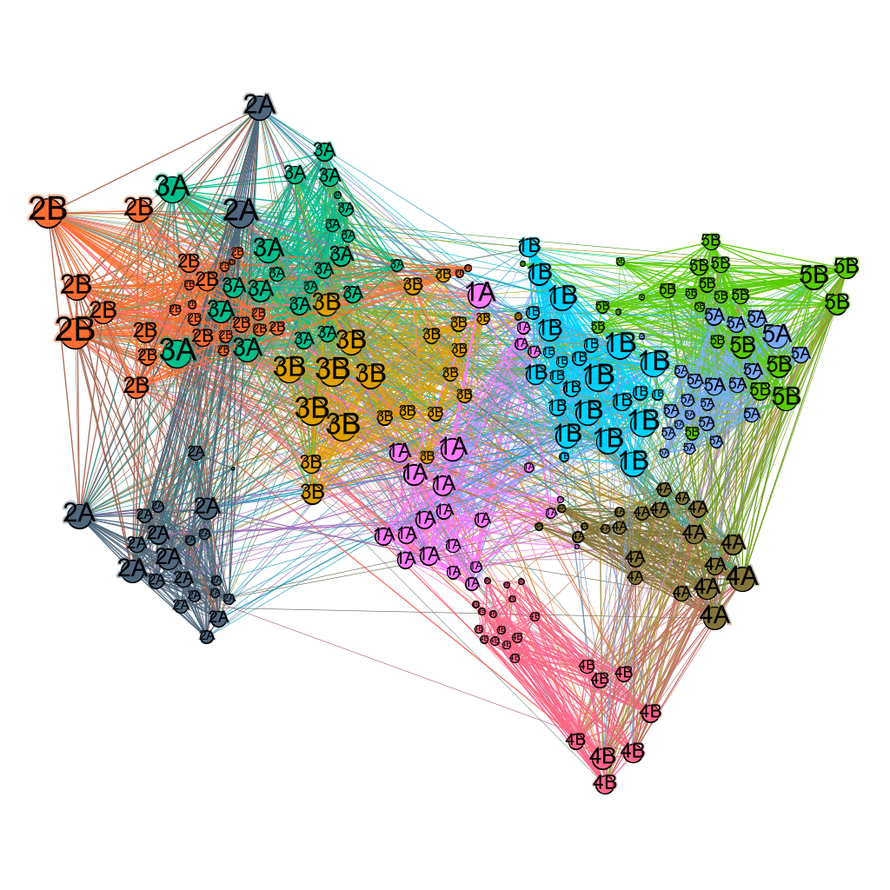
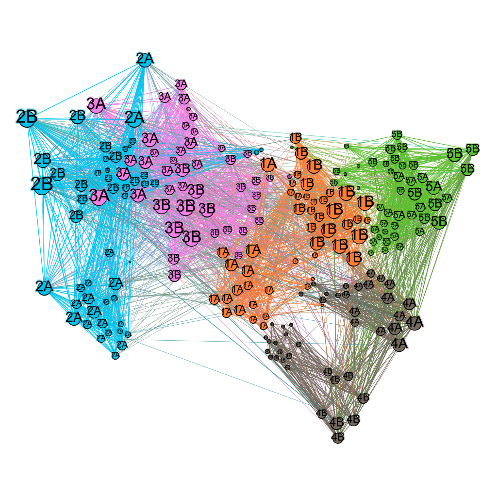

```{r setup, include=FALSE, echo=FALSE}
require("knitr")
opts_chunk$set(echo = TRUE)
library(igraph)
library(tibble)
# Optional, for including images of these types
library(jpeg) 
library(png)
# Utilities may be added here.
source("Utility/degree_domain.R")
source("Utility/nonzero_degree_distribution.R")
source("Utility/topnv.R")
```

____________________________________________________________
#### Introduction 

In this analysis we compute and interpret various forms of assortativity on a contact network of primary school students and their teachers gathered by RFID tags over two days, specifically the "Cumulative network day 1, GEXF format" and "Cumulative network day 2, GEXF format" available at: 
http://www.sociopatterns.org/datasets/primary-school-cumulative-networks/ 
Before doing the primary analysis, we perform some data preparation to address the following issues: 

* The source data is in gexf format, not readable in igraph, so we convert to graphml via Gephi. 
* We want to combine these two days of data into one network, summing the contact counts and durations on the edges. We can merge graphs in Gephi, but Gephi “Sum” strategy only sums weights, and overwrites count and duration data! Therefore we read a multi-graph and simplify in R/igraph. 
* We are interested in assortativity of students, but there are teachers in the network that we must remove. 
* We want to filter out edges for infrequent and short contacts, which may not represent significant interaction.
* We would like to analyze by grade level, but grade is coded only indirectly in the classname.

We then examine the transitivity, degree distribution, and distributions of the count and duration values. We construct G(n,m) and randomly required versions of the network for comparison. Finally, we compute the assortativities on both the natural and rewired networks, evaluate whether structural assortativity is involved, provide some supporting visualizations, and identify attributes that are predictive of connectivity. 

____________________________________________________________
#### 1. Preparing the Network 

##### (a) Conversion and Simplification

Gephi was used to convert the gexf file into a format readable by igraph that preserves attributes. We load the converted file below as PS_v1 (version 1) and summarize to show that the data includes 242 vertices and 11438 edges, the vertex attributes (classname and gender) and edge attributes (count and duration) have been preserved, while no layout attributes from Gephi have been added.

```{r}
 PS_v1 <- read_graph("Networks/combined.graphml", format="graphml")
# If you don't have have 242 vertices and 11438 edges, or you see 
#   r (v/n), g (v/n), b (v/n), x (v/n), y (v/n), size (v/n)
# go back to Gephi and fix it!
 summary(PS_v1)
```

This is a multigraph: we could not simplify it in Gephi because the "Sum" strategy only sums weights, not other attributes like weight and duration. Here we use simplify with edge.attr.comb set to sum the duration and count attributes as well as weight (which will encode number of days of contact). We print duration and count maximums before and after to ensure they are summed. 

```{r}
 print(paste("Before simplify: max count =", max(E(PS_v1)$count), 
             "max duration =", max(E(PS_v1)$duration)), 
       quote=FALSE)
# 
# # Using version numbers to enable comparison if needed for debugging. 
# 
 PS_v2 <- simplify(PS_v1, remove.multiple = TRUE, remove.loops = TRUE, edge.attr.comb = list(weight="sum", duration="sum", count="sum"))
# 
 print(paste("After simplify: max count =", max(E(PS_v2)$count), 
             "max duration =", max(E(PS_v2)$duration)), 
       quote=FALSE)
# 
# # If you don't have have 242 vertices and 8316 edges, with 
# # max count = 278 max duration = 15280, stop and fix it!  
 summary(PS_v2)
```

We will return to filtering brief contacts after removing teachers.

##### (b) Filtering Teachers 

Examining a frequency table of the values for classname below, we found that the network has teachers, but we are interested only in interactions between students. 

```{r}
table(V(PS_v2)$classname)
```

Below we filter out the teachers, saving the result in a new network PS_v3, and show the resulting network summary:  

```{r}
 PS_v3 <- delete_vertices(PS_v2, which(V(PS_v2)$classname == "Teachers"))
# # Should now have 232 vertices, 7855 edges. 
 summary(PS_v3)
```

Updated frequency tables for classname and gender are below. 

```{r}
table(V(PS_v3)$classname)
table(V(PS_v3)$gender)
```

##### (c) Filtering Incidental Contacts 

Now let's examine the edges, which represent contacts. We construct a frequency table of the number and duration of contacts, and examine the lower portion of this large table: 

```{r}
 interact <- table(count=E(PS_v3)$count, duration=E(PS_v3)$duration)
 interact[1:10,1:12] 
```

Most of the pairs have contact duration of 40 seconds or less. We want to filter them as they may be due to incidental contacts that don't reflect real interaction. We will delete edges with less than 60 seconds duration, which also removes most of the pairs having only 1 or 2 contacts. 

If we delete edges for fewer than 3 contacts we will be removing a few longer duration interactions (up to 160 seconds). Instead, we consider average duration of contact. Values on the diagonal, such as count=3, duration=60; count=4, duration=80, or more generally duration = count\*20 could have been obtained by students passing by each other count number of times for one second (as the RFID tags record a minimum of 20 seconds), and *cannot* involve interactions of more than 20 seconds. To exclude trivial contacts we require that at least one contact have duration greater than 20 seconds, i.e., duration > count\*20. 

Therefore we choose to delete edges with duration less than 60 seconds and with duration <= count\*20, naming the new graph PSF for PS Filtered. (Variations on this policy have been tried with substantially similar results in the subsequent analyses.) 

```{r}
 PSF <- delete_edges(PS_v3, which(E(PS_v3)$duration < 60))
 PSF <- delete_edges(PSF, which(E(PSF)$duration <= (E(PSF)$count)*20))
 PSF$name <- "Filtered Primary School Contacts"

# # Expecting 232 vertices 3312 edges
 summary(PSF)

# # Expecting max count 278 max duration 15280
 print(paste("After filtering: max count =", max(E(PSF)$count), 
             "max duration =", max(E(PSF)$duration)), 
       quote=FALSE)
```

 A frequency table of updated counts and durations is shown below. 

```{r}
 table(count=E(PSF)$count, duration=E(PSF)$duration)[1:10,1:12]
``` 

##### (d) Adding Grade Attribute 

We would like to analyze by grade level, but grade is coded only indirectly as classname. For example, "2A" and "2B" are the same grade level but different classes: we want to extract "2" as the value for grade. Below we have a new attribute called 'grade' and give it appropriate values by conversion of the 'classname' attribute and provide a frequency table of the new grade attribute. 

```{r}
 V(PSF)$grade <- substr(V(PSF)$classname,1, nchar(V(PSF)$classname)-1)
 table(V(PSF)$grade)
```

____________________________________________________________
#### 2. Investigating the Network

Continuing with our filtered and grade-annotated network, we prepare random models for the network, compute some relevant metrics, and plot degree and attribute distributions. 

##### (a) Random Models 

A random G(n,m) graph model is constructed below. 

```{r}
 PSF_gnm  <- sample_gnm(vcount(PSF), ecount(PSF), directed=TRUE)
 summary(PSF_gnm)
```


A randomly rewired configuration model is constructed below (retaining attribute information). 

```{r}
 # Use niter = ecount(PSF)*1000 for sufficient rewiring 
PSF_rrw  <- PSF %>% rewire(keeping_degseq(niter = ecount(PSF)*1000))
PSF_rrw$name <- "Rewired Primary School Contacts"
summary(PSF_rrw)
```

##### (b) Transitivity 

Below we compute global transitivity for the filtered network and the two random models, and interpret it taking density of the network into account.

```{r}
tibble(
"Global Transitivity PSF" = transitivity(PSF, type="global"),
"Global Transitivty PSF_gnm" = transitivity(PSF_gnm, type="global"),
"Global Transitivity PSF_rrw" = transitivity(PSF_rrw, type="global")
)

 tibble(
  "Edge Density PSF" = edge_density(PSF),
  "Edge Density PSF_gnm" = edge_density(PSF_gnm),
  "Edge Density PSF_rrw" = edge_density(PSF_rrw)
 )
```

Social networks tend to have high values of transitivity coefficient. In our example, on average, the chance that two entities share a common entity is almost 1/2. This is rather high considering that the random G(n,m) model and the randomly rewired model are both lower than 1/5. A node having an edge density of 0.12 indicates that there aren't that a node does not have many edges either compared to the number of possible edges it could have. The transitivity does not seem to be influenced by random connections. The degree distribution as well is quite low which means this particular network has a high ratio of triangles and connected triples although a node may not have many connections. 

##### (c) Degree Distribution 

We plot degree distribution in both lin-lin and log-log forms. 

```{r warning=FALSE}
# Code to plot the degree distribution of PSF using both lin-lin and
# log-log axes.

plot(degree_distribution(PSF),
       log="xy", xlab="k", ylab="p(k)", xlim = c(4,60),
       main= "Log Log Degree Distribution of PSF")

plot(degree_distribution(PSF),
      xlab="k", ylab="p(k)",
       main= "Lin Lin Degree Distribution of PSF")

```

Looking at both log log and lin lin graph formats of the degree distribution for PSF, it seems like it is definitely leaning towards the somewhat-normal distribution structure (i.e., lin lin looks like a bell curve except for values between 40-50). From our previous analysis, I don't necessarily agree that randomness is affecting the degree distribution as much as preferential attachment. Nodes don't have that many connections so the nodes must be choosing other nodes that are easier to connect to which helps explain the high transitivity. 


##### (d) Attribute Distributions 

Below we plot the frequency distributions of count and duration of contact.

```{r warning=FALSE}
# Code to plot frequency distribution of E(PSF)$count with both
# lin-lin and log-log axes. Label the plots appropriately and make
# sure the x axis is the values not the index into the vector.

count_freq <- tabulate(E(PSF)$count)
#remove 0 values from plot by setting it to NA 
count_freq[count_freq==0] <- NA

plot(count_freq,
     log="xy", xlab="k", ylab="p(k)",
       main= "Log Log Frequency Distribution of $count",
     )

plot(count_freq, 
      xlab="k", ylab="p(k)",
       main= "Lin Lin Frequency Distribution of $count",
     )
```

```{r warning=FALSE}
# Code to plot frequency distribution of E(PSF)$duration with both
# lin-lin and log-log axes. Label the plots appropriately and make
# sure the x axis is the values not the index into the vector.

duration_freq <- tabulate(E(PSF)$duration)
#remove 0 values from plot by setting it to NA 
duration_freq[duration_freq==0] <- NA

plot(duration_freq,
     log="xy", xlab="k", ylab="p(k)", xlim = c(50,16000),
       main= "Log Log Frequency Distribution of PSF$duration",
     )

plot(duration_freq,
      xlab="k", ylab="p(k)",
      main= "Lin Lin Frequency Distribution of PSF$duration",
     )
```

Obviously, if you look at the lin lin version of the graph it shows a heavily tailed distribution even with non-zero visualization. But if you observe the log log versions, it definitely resembles a scale-free network where the graph is almost linear. The plots are visualizing either count or duration. For count, the most values appear to be within 50-100 whilst the the most duration seems to lie between 2000-7000. We can conclude that the most contact time is approximately an hour. 
____________________________________________________________
#### 3. Assortativities

Now we address the primary question: based on the data available to us, what predicts interactions between primary school students? Interactions may be shaped partly by the environment: students presumably are more likely to be nearby or interact with those in the same classroom. Interactions may also reflect choices made by the students within and outside the classroom, e.g., to associate with students according gender, grade level, or popularity (for which degree is a proxy). 

##### (a) Assortativity Computations 

Below we compute assortativity metrics on various attributes to assess these hypotheses. 

* Degree assortativity assesses the influence of popularity 
* Nominal assortativity on Gender assesses whether students interact primarily with same or other gender students
* Nominal assortativity on classname assesses whether students interact primarily with other students in their class. 
* Ordinal assortativity on grade assesses whether age is a factor by itself in predicting interactions. 

We also compare to the Configuration model (rewired graph) to see whether each given assortativity is structural.

```{r}
# Code to construct a table of assortativities: 
# Natural PSF | degree | gender | classname | grade
# Rewired PSF | degree | gender | classname | grade

tibble(
  GraphType = "Natural PSF",
  Degree = assortativity_degree(PSF),
  NominalGender = assortativity.nominal(PSF, as.numeric(as.factor(V(PSF)$gender))),
  NominalClass = assortativity_nominal(PSF, as.numeric(as.factor(V(PSF)$classname))),
  OrdinalGrade = assortativity(PSF, as.numeric(as.factor(V(PSF_rrw)$grade)))
  

)

tibble(
  GraphType = "Rewire PSF",
  Degree = assortativity_degree(PSF_rrw),
  NominalGender = assortativity.nominal(PSF_rrw, as.integer(as.factor(V(PSF_rrw)$gender))),
  NominalClass = assortativity_nominal(PSF_rrw, as.integer(as.factor(V(PSF_rrw)$classname))),
  OrdinalGrade = assortativity(PSF_rrw, as.integer(as.factor(V(PSF_rrw)$grade)))
  

)

```


##### (b) Plotting Strongest Assortativity 

Grade has the highest assortativity, so we plot grade against grade to see the distribution.

```{r}
# Plot the $grade values for the vertices at the head_of and tail_of
# ends of the edges against each other, e.g., head_of on x axis and
# tail_of on y axis. You may take any approach that makes a nice plot,
# for example: plot with jitter (adjust the factor) as done in class;
# smoothScatter (which provides a heat map); or ggplot geom_bin_2d if
# you are familiar with it. I think smoothScatter will be the easiest. 

smoothScatter(head_of(PSF, E(PSF))$grade, tail_of(PSF, E(PSF))$grade,
             xlab="Grade", ylab="Grade", main="Assortativity: Grade vs Grade")

```


##### (c) Network Visualization 

We write out the filtered annotated graph to visualize in Gephi, colored by the top two assortative features. 

```{r}
write_graph(PSF, "Networks/Primary-School-Students-Filtered.graphml", format="graphml")

# No need for pdf or labels: just a clear visualization of structure
# and the following two different colorings are sufficient to make the
# point.
```

**Colored by Classname**
```{r  echo=FALSE, fig.align="center", fig.cap = "PS by Classname"}
 
```

**Colored by Grade**
```{r  echo=FALSE, fig.align="center", fig.cap = "PS by Grade"}
 
```

##### (d) Interpretation 

The structure of the assortativities seem to follow preferential attachment. When we look at this visualization between grades 1-5, obviously, all the grades prefer to be in contact with other members of their grade (i.e., 5A prefers 5A, whilst 5B prefers 5B). This doesn't necessarily mean that contact is segregated as we see in the second visualization that although sub grades (i.e., A and B) prefer each other, there are still multiple connections between the grades themselves (i.e., 5A prefers 5A then 5B). Interestingly, the most grade crossover happens between 2B and 3A. I would assume this is probably because they share a common activity or entity (i.e., same teacher, same recess time, same lunch time, same classes, same extracurricular). There is not enough information to fully agree which factor is the most critical in this crossover influence but we can assume it must be one of these things. There are instances where grade levels crossover not as much such as 2A and 4B. Perhaps these are outliers in which students are actually related. Nodes that are visibly the biggest indicate that these are the popular students that have the most friends. Probably due to extracurricular activities where crossover meetups can happen. If the school wanted to integrate a more connected approach, we would suggest them to create more activities where crossover meetups are more common. Especially for grade 4 and grade 5 where we see that these students prefer 1-3 connections only or perhaps more generally, this is where they start to create more personal friend groups then having more overall friends. 

____________________________________________________________
### Pau 
