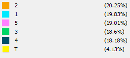

```{r setup, include=FALSE, echo=FALSE}
require("knitr")
opts_chunk$set(echo = TRUE)
library(igraph)
library(tibble)
# For including images of these types
library(jpeg) 
library(png)
# Utilities may be added here.
```

____________________________________________________________
### Introduction 

In this document we demonstrate methods of community structure analysis by analyzing the community structure of two networks: 

* A primary school contact network, with teachers included 
* A co-appearance network of comic book heroes. 

____________________________________________________________
### Primary School Contact Network 

In a previous analysis, we conducted an assortativity analysis of a contact network of primary school students and their teachers gathered by RFID tags, specifically the "Cumulative network day 1, GEXF format" and "Cumulative network day 2, GEXF format" available at: http://www.sociopatterns.org/datasets/primary-school-cumulative-networks/. In that analysis, we combined the two days of data and converted the network to a format readable in igraph, which we use again here. 

____________________________________________________________
#### 1. Preparing the Primary School Network

##### (a) Conversion and Simplification 

Gephi was used to convert the gexf file into a format readable by igraph that preserves attributes. We load the converted file below as PS_v1 (version 1) and summarize to show that the data includes 242 vertices and 11438 edges, the vertex attributes (classname and gender) and edge attributes (count and duration) have been preserved, while no layout attributes from Gephi have been added. 


```{r}
PS_v1 <- read_graph("Networks/sp_data_school_day_1_2_multigraph.graphml", 
                 format="graphml")
summary(PS_v1)
```

This is a multigraph: we could not simplify it in Gephi because the "Sum" strategy only sums weights, not other attributes like weight and duration. Here we use simplify with edge.attr.comb set to sum the duration and count attributes as well as weight (which will encode number of days of contact). We print duration and count maximums before and after to ensure they are summed. 

```{r}
print(paste("Before simplify: max count =", max(E(PS_v1)$count), 
            "max duration =", max(E(PS_v1)$duration)), 
      quote=FALSE)
PS_v2 <- simplify(PS_v1, edge.attr.comb = list(weight="sum", duration="sum", count="sum", "ignore"))

print(paste("After simplify: max count =", max(E(PS_v2)$count), 
            "max duration =", max(E(PS_v2)$duration)), 
      quote=FALSE)
summary(PS_v2)
```

Unlike our previous analysis, in this analysis *we will retain teachers*, as they are important community members. So we skip that step from Analysis 6. 

**Filtering Incidental Contacts**

A table of the low order contact frequency (rows) and duration (columns) shows that there are many spurious contacts: 

```{r}
table(E(PS_v2)$count, E(PS_v2)$duration)[1:12,1:12]
```

Filtering is based on the following observations and criteria:

* We decide that a continuous interaction of 60 seconds is sufficient to indicate real contact between students.

* The large numbers of brief interactions in table positions 1,20, 1,40 and 2,40 should be removed, but this is not sufficient for the following reason.

* The minimum resolution of the RFID tags is 20 seconds (“20” is recorded even if students were in contact for only 1 second). Thus, values on the diagonal where duration = count\*20 could have been obtained by students passing by each other count number of times with proximity lasting as little as however many seconds are needed for the tags to communicate, and cannot involve interactions of more than 20 seconds.

* To exclude trivial contacts we require that at least one contact have duration of 60 seconds or more. (We also allow two contacts of 40 seconds or more because these will be hard to distinguish with this aggregated data.)

* We accomplish this by requiring that duration >= (count\*20) + 40. The count\*20 provides the baseline number one might get with count spurious interactions. By adding 40, this requires that at least one of these count contacts is 60 seconds (20 + 40), or two of them are at least 40 seconds.

This policy will remove most of the edges on the first two nonzero values in each row (the first two diagonals), and leads to cleaner visualization in Gephi.

We apply this policy below, naming the new graph PSF for PS Filtered. (Variations on this policy have been tried with substantially similar results in the analysis that follows.)

```{r}
PSF <- delete_edges(PS_v2, E(PS_v2)[duration < (count*20) + 40])
PSF$name <- "Filtered Primary School Contacts"

# Expecting 242 vertices 2759 edges
summary(PSF)
```

A frequency table of updated counts and durations is shown below. 

```{r}
table(count=E(PSF)$count, duration=E(PSF)$duration)[1:10,1:12]
``` 

**Adding Grade Attribute**

We would like to analyze by grade level, but grade is coded only indirectly as classname. Below we  a new attribute called 'grade' and give it appropriate values by conversion of the 'classname' attribute and provide a frequency table of the new grade attribute. 

```{r}
V(PSF)$grade <- substr(V(PSF)$classname, 1, 1)
table(V(PSF)$grade)
```

Notice that unlike the previous analysis the grade attribute includes "T" for Teacher, a non-numeric value. This will affect how we compute assortativity. 

**Simplifing Attribute Labels for Visualization** 

We shorten these vertex attributes so they take less space when visualized, changing \$gender "Unknown" to "U" and \$classname "Teachers" to "T", resulting in the following sets of values: 

```{r}
V(PSF)$gender <- replace(V(PSF)$gender, V(PSF)$gender=="Unknown", "U")
sort(unique(V(PSF)$gender))
V(PSF)$classname <- replace(V(PSF)$classname, 
                            V(PSF)$classname=="Teachers", "T")
sort(unique(V(PSF)$classname))
```

____________________________________________________________
#### 2. Computing and Comparing Partitions

Below we compute partitions using the InfoMap and Louvain community detection methods, and compare them to each other and two node attributes that may predict connectivity, Classname and Grade. All of these partition the network. We ask: how well does each partitioning capture the connectivity of the nodes? how similar are the partitions to each other?

##### (a) Community Detection Partitions 

**InfoMap** 

In order to account for the wide variation in duration of contacts, we use contact duration as edge weights in this analysis. The resulting community sizes are displayed.  

```{r}
PSF.infomap <- cluster_infomap(PSF, e.weights= E(PSF)$duration)
sizes(PSF.infomap)
```

**Louvain** 

Again, we use contact duration as edge weights in this analysis. The resulting community sizes are displayed. 

```{r}
PSF.louvain <- cluster_louvain(PSF, weights = E(PSF)$duration)
sizes(PSF.louvain)
```

##### (b) Comparison by Modularity and Assortativity 

The attribute based and computed partitions are compared on these metrics: 

```{r}
# Reminder: unlike Analysis 6, grade now includes "T"  
 rbind(
   tibble(metric = "Modularity",
          Classname = modularity(PSF, as.integer(as.factor(V(PSF)$classname))),
          Grade     = modularity(PSF, as.integer(as.factor(V(PSF)$grade))),
          Louvain   = modularity(PSF.louvain),
          InfoMap   = modularity(PSF.infomap),
   ),
          
   tibble(metric = "Assortativity",
          Classname = assortativity_nominal(PSF, as.integer(as.factor(V(PSF)$classname))),
          Grade     = assortativity_nominal(PSF, as.integer(as.factor(V(PSF)$grade))),
          Louvain   = assortativity(PSF, membership(PSF.louvain)),
          InfoMap   = assortativity(PSF, membership(PSF.infomap))
   )
 )
```

**Explanation of Rank Ordering of Metrics**

Assortativity is modularity scaled such that 1 is the maximum value it can have. We might expect that this means that assortativity is always larger, yet we see that this is not the case for Louvain and InfoMap.

This would indicate that modularity on Louvain and InfoMap are returning that there are slightly more communities detected than how well Louvain and InfoMap are in assortativeness. Maybe it is because we're applying assortativity on the specific communities of PSF.louvain or PSF.infomap. Modularity measures how separated are the different vertex types from each other so assuming my numbers are correct, the amount of communities that are present is more than the amount of connected vertices that have the same labels or similar assigned values. Or perhaps it is because we considered the weights for both Louvain and Infomap to be based on duration. Although there isn't a lot of connections, the weights of duration for these connections are finding more communities than usual through modularity optimization and flow optimization. 

From the previous assignment, I remember that PSF had different grade levels so based on the information above, most students are in communities (i.e., grade), but they don't talk to other students in other grades as much, and they probably don't talk to everyone in their own grade either. This could possibly explain the previous question on why assortativity is lower. (I use this reasoning for the question below as well).

**How Well Partitions Reflect Network Connectivity** 

Setting these differences aside, these metrics indicate how well each partition reflects the connectivity of the network as follows. 

Modularity indicates that majority of the nodes in PSF belong to a community if Louvain and InfoMap returned 0.70. You would assume then there would be a lot of nodes connected to each other but that isn't the case. Assortativity indicates that although majority of the nodes are in communities, the degree of correlation between connected nodes is lower than the amount of communities there are. Or in other words, the preference for a network's nodes to attach to others that are similar is lower than the amount of communities present. 

I assume this means that the network does not have many nodes crossing over to other communities but rather stays within their own communities; and even then, the nodes probably don't talk as much to other nodes within their own communities. Reasoning based on previous question above. 

From the previous assignment, I remember that PSF had different grade levels so based on the information above, most students are in communities (i.e., grade), but they don't talk to other students in other grades as much, and they probably don't talk to everyone in their own grade either. This could possibly explain the previous question on why assortativity is lower.

But this leaves open the question of how these partitions compare to each other. 

##### (c) Comparison by Normalized Mutual Information 

Normalized Mutual Information tells us how much information a pair of partitioning (interpreted as random variables) share with each other. It is  normalized to [0,1], making it like a correlation coefficient. (https://en.wikipedia.org/wiki/Mutual_information) 


```{r}

# Using any approach you prefer, make a correlation matrix of this form:
# partition  Classname  Grade      InfoMap    Louvain 
# Classname  x.xxxxx    x.xxxxx    x.xxxxx    x.xxxxx
# Grade      x.xxxxx    x.xxxxx    x.xxxxx    x.xxxxx
# InfoMap    x.xxxxx    x.xxxxx    x.xxxxx    x.xxxxx
# Louvain    x.xxxxx    x.xxxxx    x.xxxxx    x.xxxxx

# I ended up using a conventional programming for-loop approach. There
# is probably an elegant R-style approach, but the tibble-based
# solution I constructed required repeating code that constructs
# membership lists, which did not seem any more elegant than a loop.


rbind(
   tibble(parition = "Classname",
          Classname = compare(V(PSF)$classname, V(PSF)$classname, method = "nmi"),
          Grade     = compare(V(PSF)$classname, V(PSF)$grade, method="nmi"),
          Louvain   = compare(V(PSF)$classname, membership(PSF.louvain), method="nmi"),
          InfoMap   = compare(V(PSF)$classname, membership(PSF.infomap), method="nmi"),
   ),
          
   tibble(parition = "Grade",
          Classname = compare(V(PSF)$grade, V(PSF)$classname, method = "nmi"),
          Grade     = compare(V(PSF)$grade, V(PSF)$grade, method="nmi"),
          Louvain   = compare(V(PSF)$grade, membership(PSF.louvain), method="nmi"),
          InfoMap   = compare(V(PSF)$grade, membership(PSF.infomap), method="nmi"),
   ),
   
   tibble(parition = "Louvain",
          Classname = compare(membership(PSF.louvain), V(PSF)$classname, method = "nmi"),
          Grade     = compare(membership(PSF.louvain), V(PSF)$grade, method="nmi"),
          Louvain   = compare(membership(PSF.louvain), membership(PSF.louvain), method="nmi"),
          InfoMap   = compare(membership(PSF.louvain), membership(PSF.infomap), method="nmi"),
   ),
   
   tibble(parition = "Infomap",
          Classname = compare(membership(PSF.infomap), V(PSF)$classname, method = "nmi"),
          Grade     = compare(membership(PSF.infomap), V(PSF)$grade, method="nmi"),
          Louvain   = compare(membership(PSF.infomap), membership(PSF.louvain), method="nmi"),
          InfoMap   = compare(membership(PSF.infomap), membership(PSF.infomap), method="nmi"),
   )
 )
```

Because the table above essentially represents a multiplication matrix you're going to see repeating values for the the same (x,y) and (y,x). However, if we ignore that for a second, consider the the highest values from our comparison table. Infomap and classname surprisingly does well as the highest distance between the two community structures at 0.93 but not grade which is the lowest out of all comparisons at 0.76. The inverse is somewhat true for louvain. Louvain and classname is relatively low at 0.79 whilst louvain and grade is relatively mid at 0.87. 

Perhaps we can consider the relationship that louvain is to classname as infomap is to grade. Louvain and classname has low correlation because louvain is considered more generic whilst infomap and grade has less correlation because infomap is considered more "granular" and picks out individual classnames better. 

____________________________________________________________
#### 3. Examining Results in Gephi

Visualizations in Gephi will be used to interpret the partitions.

##### (a) Exporting Results to Gephi 

Community membership is assigned to vertices under attributes $louvain and $infomap.

```{r}
 V(PSF)$louvain <- membership(PSF.louvain)
 V(PSF)$infomap <- membership(PSF.infomap)
```

In Gephi, we want to visualize edges weighted by edge attribute 'duration'. But Gephi does not let us specify the location of the weights, and always uses the 'weight' attribute. So, we want to write duration into the weight attribute. However, inspection reveals that there are two values: 1 and 2. These come from collapsing the multigraph, and indicate the number of days on which two students had contact. We'll first preserve this information in case it is useful in 'days'. 

```{r}
sort(unique(E(PSF)$weight))
 E(PSF)$days <- E(PSF)$weight
 E(PSF)$weight <- E(PSF)$duration
summary(PSF)
```

Then we write out a graphml file for inspection in Gephi.

```{r}
write_graph(PSF, "Networks/Primary-School-Students-Filtered.graphml", format="graphml")
```

##### (b) Spatialized Visualization in Gephi 

A spatialized visualization of the network was constructed in Gephi using Force Atlas 2 and the following parameters: 

* Nodes sized by degree and labeled with their classname and gender. 
* Lin-Log mode 
* Prevent Overlap filter 
* Edge Weight Influence set to 0 (otherwise the large duration weights will compress the layout)
* Gravity 2.0 to get a compact but not crowded visualization. 

Nodes were labeled with classname and gender. Please see the enclosed Gephi project Primary-School-Communities.gephi for high resolution images. Results are illustrated in the following screen captures. 

##### (c) Visualization of Partitions 

Below we visualize partitioning by classname, grade, InfoMap, and Louvain by coloring the above spatialized visualization by these partitions. Color keys are provided. We organize the results to highlight similarities, but leave the discussion for the next section. 

**Partition by Classname** 

```{r  echo=FALSE, fig.align="center", fig.cap = "Partition by Classname"}
 include_graphics("Images/classname.png", dpi=150)
```

```{r  echo=FALSE, fig.align="center", fig.cap = "Classname Color Key"}
# Please include a color key from Gephi here 
 
```

**Partition by Grade** 

```{r  echo=FALSE, fig.align="center", fig.cap = "Partition by Grade"}
 include_graphics("Images/grade.png", dpi=150)
```

```{r  echo=FALSE, fig.align="center", fig.cap = "Grade Color Key"}
# Please include a color key from Gephi here
 
```

**Partition by infomap** 

```{r  echo=FALSE, fig.align="center", fig.cap = "Partition by infomap"}
 include_graphics("Images/infomap.png", dpi=150)
```

```{r  echo=FALSE, fig.align="center", fig.cap = "infomap Color Key"}
# Please include a color key from Gephi here 
 
```

**Partition by louvain** 

```{r  echo=FALSE, fig.align="center", fig.cap = "louvain Partition"}
 include_graphics("Images/louvain.png", dpi=150)
```

```{r  echo=FALSE, fig.align="center", fig.cap = "louvain Color Key"}
 
```

##### (d) Discussion: Comparison of Partitions 

We discuss three comparisons: 

**Comparing Community Detection Methods to Each-other**

When we look at the visulizations between Louvain and Infomap the obvious difference is that louvain returned that 6 communities were detected whilst infomap returned that 10 communities that were detected. Probably because infomap is better at detecting that certain students prefer to talk to a members of the same specific grade (2A, 2B) but louvain is detecting that there are enough interactions between students of the same grade that it considers all of them to be within the same community with an exception for grade 1 where it successfully detected that 1A (1.0) and 1B (4.0) are technically separate communities. This isn't entirely wrong but I guess you could interpret that as, "less accurate."

**Comparing Community Detection Methods to Classname and Grade**

When we consider the visualizations between the community detection methods to classname and grade we see that my assumptions from the previous question is correct. Infomap does a good job detecting that although there are 5 grade levels, there is also a sub division between grade XA and XB where you can consider this another set of communities. Louvain only detected this with grade 1 where it detected a difference in community between 1A (1.0), and 1B (4.0). 

##### (e) Observations about Actor Behavior

Based on all of the above analyses, we can draw these conclusions about student and teacher behavior: 

**Observations about Collective Behavior** 

Interestingly, if you consider the node sizes between students and teachers, teachers are visually smaller in physical size. This indicates that although student and teacher connections are guaranteed, or it is guaranteed for a student node to have an edge connection with a teacher node, this doesn't entirely mean that teachers are the most popular. Teacher nodes themselves aren't even acting as bridges to other communities but rather stick to their own specific grade (i.e., 1A, 1B) communities. 

The student nodes that border the communities act as their own bridges that talk to other communities. This is supported by their physical size being noticeably bigger as size is based on degree, and the edge connections are dense when attaching to nodes in other communities. There's probably a lot of student cross over behavior because of similar school activities (i.e., breakfast, recess, lunch, lunch recess, same teachers every grade, extracurriculars). However, also consider that grade XA and XB probably share similar classes. If I recall from elementary school, although we had different teachers, there were non-main subject classes (i.e., music, hula, arts, P.E.) where the entire grade level was in a single class. The data set is small enough to show that there is about 20 students per classroom so it's entirely possible to have a joint class session with 40 students. Perfect way to allow students to create more "edges" and have the students that border communities act as "popular" kids. 


```{r  echo=FALSE, fig.align="center", fig.cap = "__________"}
# include_graphics("Images/__________")
```

**Observations about Salient Individuals or Pairs** 

There are cases where the edges are thicker than usual in visual appearance indicating that certain students or pairs of students have a stronger connection. Because the weights are determined by duration, I would assume these strong connections indicate that the students are probably real-life friends and not just friends at school (i.e., play outside of school whether it be real-life hanging or gaming online). Especially in the top border of 1B of the classname visualization, you can see loops between students with thick blue edges. These probably indicate strong friend groups which is technically a community of their own. 

```{r  echo=FALSE, fig.align="center", fig.cap = "__________"}
# include_graphics("Images/__________")
```

____________________________________________________________
### Hero Coappearance Network

In this section we examine a network derived from the Marvel Social Network Networks of super heroes, constructed by Cesc Rosselló, Ricardo Alberich, and Joe Miro (http://bioinfo.uib.es/~joemiro/marvel.html). The original network connects comic book heroes to the issues they appeared in. We work with a projection onto heroes, with links between heroes weighted by the number of issues they co-appeared in. We are interested in identifying and interpreting several of the largest "communities" of heroes in this network.

____________________________________________________________
#### 4. Preparing the Hero Coappearance Network

The network is read in and summarized below. 

```{r}
Heroes <- read_graph("Networks/Hero-Coappearance-Network.graphml", 
                 format="graphml")
summary(Heroes)
```

We compute the Louvain and InfoMap partitions and annotate vertices with their partition membership below. We also compute node centrality metrics on the full network, to aid in interpretation (by comparison to partition-specific centrality metrics to be computed in Gephi). The resulting annotated network is shown below and written out for visualization in Gephi. 

```{r}
 Heroes.louvain     <- cluster_louvain(Heroes, weights= E(Heroes)$weight)
 Heroes.infomap     <- cluster_infomap(Heroes, e.weights = E(Heroes)$weight)
 V(Heroes)$louvain  <- membership(Heroes.louvain)
 V(Heroes)$infomap  <- membership(Heroes.infomap)
 V(Heroes)$degree   <- degree(Heroes)
 V(Heroes)$wdegree  <- strength(Heroes, weights=E(Heroes)$weight)
 V(Heroes)$pagerank <- page_rank(Heroes)$vector
 summary(Heroes)
 write_graph(Heroes,"Hero-Communities.graphml", format="graphml")
```

____________________________________________________________
#### 5. Finding Crossing Vertices 

Crossing edges are edges that cross partitions. The vertices at the endpoint of these edges are of interest, especially if they participate in many crossings, as they may be involved in multiple communities beyond the one that the partition assigned to them. Below we display the top 20 of vertices ranked by the number of crossing edges incident on them in each of the two partitions: 

```{r}
# Display the top 20 crossing vertices and the number of edges via
# which they connect to others outside their partition, for both
# Louvain and Infomap. I suggest taking these steps

# Compute crossings for Louvain, sorted decreasing by crossing: 

# Compute crossings for Infomap, sorted decreasing by crossing: 

# Display in combined tibble: 


 tibble(Hero_in_Louvain = V(Heroes)[sort(table(V(Heroes)[ends(Heroes, which(crossing(Heroes.louvain, Heroes)))]$id),decreasing=TRUE)[1:20]]$label,
        Cross_Count_L   = sort(table(V(Heroes)[ends(Heroes, which(crossing(Heroes.louvain, Heroes)))]$id),decreasing=TRUE)[1:20],
        Hero_in_Infomap = V(Heroes)[sort(table(V(Heroes)[ends(Heroes, which(crossing(Heroes.infomap, Heroes)))]$id),decreasing=TRUE)[1:20]]$label,
        Cross_Count_I   = sort(table(V(Heroes)[ends(Heroes, which(crossing(Heroes.infomap, Heroes)))]$id), decreasing=TRUE)[1:20]
 )
```

____________________________________________________________
#### 6. Interpreting Communities in Gephi 

##### (a) Visualization in Gephi 

The network has been read into Gephi and a spatialized visualization has been constructed, but is too complex to show here. Excerpts will be taken as needed to illustrate the following interpretations of partitions. 

```{r}
write_graph(Heroes, file="Networks/Hero-Coappearance-Network.graphml",format = "graphml")

```

##### (b) Partitions of Interest

The following partitions have clear interpretations in terms of the comic hero "universe", and thereby illustrate the power of community detection methods for finding meaningful subgraphs based on structural information alone. 

The visualization was difficult but I filtered out enough things to find 3 communities which are probably the most notable and central. This figure was made by setting node size to eigenvector centrality, coloring by infomap and choosing 10 arbitrary colors. I then set everything that isn't the big 3 communities to white and filtered by partition infomap. 

```{r  echo=FALSE, fig.align="center", fig.cap = "The Big 3"}
 
```

**First Partition** 

This figure was made by setting node size to eigenvector centrality, coloring by infomap and choosing 10 arbitrary colors. I then set everything that isn't the big 3 communities to white and filtered by partition infomap. 

For this particular partition with infomap colored in pink, we see a community of general "main" marvel villains. This is supported by the fact we see repeating titles of "[insert marvel character name] Doppelganger". In the comics there were a lot of clone stories where the characters have to face themselves. Towards the middle right of the figure we see popular villains such as Thanos, Galactus, Death, and further down we can see Surfer. These are all marvel characters that have prominent cameos in the marvel cinematic universe as villains as well. 

```{r  echo=FALSE, fig.align="center", fig.cap = "Avengers Villains"}
 
```

**Second Partition** 

This figure was made by setting node size to eigenvector centrality, coloring by infomap and choosing 10 arbitrary colors. I then set everything that isn't the big 3 communities to white and filtered by partition infomap. 

In this particular partition colored in red, we see evidence that these characters are main members of Marvel Avengers or heavily related to the Avengers with notable names such as Scarlet Witch, Vision, Hawk, Iron Man, , Captain America, Hulk, Wasp, Quicksilver, Jarvis, etc. 

```{r  echo=FALSE, fig.align="center", fig.cap = "Avengers"}
 
```

**Third Partition** 

This figure was made by setting node size to eigenvector centrality, coloring by infomap and choosing 10 arbitrary colors. I then set everything that isn't the big 3 communities to white and filtered by partition infomap. 

This one I got lucky. I read some comics and watched the original Fantastic 4 movies to immediately know the character names right under the previous two communities. Based on the names, we see evidence that this community is based on the Fantastic 4 storyline/series (i.e., Dr. Doom, Invisible Woman, Human Torch, Mr. Fantastic, Thing, etc.)

```{r  echo=FALSE, fig.align="center", fig.cap = "Fantastic 4"}
 
```


##### (c) Implications of Crossing Vertices

Comparing the high-centrality (important) hero figures in the above partitions to the crossing vertices analysis performed previously, we see that many heroes central in a single partition are also high on the crossing vertices list. 

This fact suggests that in the comic universe, these heroes and villains alike, play a role in communities and sub communities. Our infomap interpretation of the comic book data set shows that although these characters have a main community they participate in, notably Marvel villains, Marvel Avengers, and Fantastic 4, it doesn't necessarily mean they are restricted to their own community. Alot of characters cross over themselves as team members or villains with comic issues that have to provide fresh plot lines, cross over plot lines, dark plot lines, fan service, multi-verse plot lines, time travel plot lines, and the infamous capcom vs marvel series. The crossing edges and crossing vertices is an indication of that. 

It also suggests a limitation of the above community detection methods: These community detection methods only show surface level communities and doesn't show the intricate details and cross over plot lines written by the comic book writers and artists as a lot of characters in my visualization probably has an undetected community (comic series) with a rich plot line showing that they were in fact apart of a whole different set of communities. 

____________________________________________________________
### Pau 
