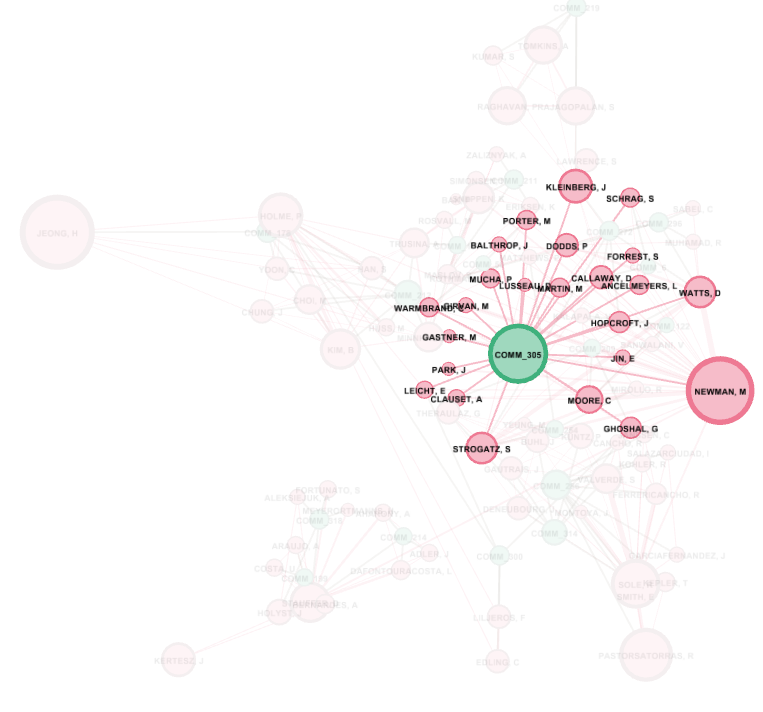

```{r setup, include=FALSE, echo=FALSE}
require("knitr")
opts_chunk$set(echo = TRUE)
library(igraph)
library(tibble)
library(linkcomm)
# For including images of these types
library(jpeg) 
library(png)
# Utilities may be added here.
source("Utility/reify_link_communities.R")
```

____________________________________________________________
#### Introduction 

This analysis demonstrates overlapping community detection with the "linkcomm" (link communities) package. We include analyses that help us understand the link communities algorithm and analyses that help us see how the results inform us about an application domain. 

The software package is documented by Kalinka, A. T. (2014). The generation, visualization, and analysis of link communities in arbitrary networks with the R package linkcomm (CRAN project vignette). The underlying algorithm and link similarity metrics are described by.  Ahn, Y.-Y., Bagrow, J. P., & Lehmann, S. (2010). Link communities reveal multiscale complexity in networks. Nature, 466, 761-765.

We analyze the Network Science co-authorship network constructed by Mark Newman, who used weights to model strength of collaboration based on number of co-authors on a paper and number of papers authored together. The questions we ask are only concerned with dichotomous presence or absence of co-authorship, so we compute link communities on an unweighted network to better match our questions and to simplify interpretation of results. We also compute Louvain and InfoMap community partitions for comparison. 

____________________________________________________________
#### 1. Computing and Visualizing Link Communities 

##### (a) Preparation of the Network

The network we analyze is read in and summarized below. 

```{r}
NS <- read_graph("Networks/netscience.graphml", 
                 format="graphml")
summary(NS)
```

We compute node centralities that may help us later in our interpretations, and save the centralities as vertex attributes. 

```{r}
# Compute unweighted degree, weighted degree, unweighted page rank,
# and unweighted betweenness centrality for the vertices in this
# graph, and assign them to vertices as attributes

V(NS)$degree <- degree(NS)
V(NS)$wdegree <- strength(NS, mode="all")
V(NS)$pagerank <- page_rank(NS)$vector 
V(NS)$betweenness <- betweenness(NS, normalized=TRUE, weights=1/E(NS)$weight)
summary(NS)
```

We also compute unweighted Louvain and InfoMap partitions for later use in comparison to overlapping link communities. 

```{r}
# Compute unweighted cluster_louvain and unweighted cluster_infomap
# community membership, and assign these as attributes to the
# vertices.
V(NS)$louvain  <- membership(cluster_louvain(NS))
V(NS)$infomap  <- membership(cluster_infomap(NS))
summary(NS)
```

##### (b) Computing Link Communities 

Unweighted link communities are computed below, using the "average" hierarchical clustering method. 

```{r}
# Construct an unweighted edge list.
# Compute link communities with hcmethod "average", and verbose=FALSE
#   and plot=FALSE. DO NOT USE {r echo=FALSE}: it hides the code 
# Print the link community object

NS_edges <- as_edgelist(NS)
head(NS_edges)

NS_lc <- getLinkCommunities(NS_edges, hcmethod="average", verbose=FALSE, plot=FALSE)
print(NS_lc)
```

We "reify" link communities, using a utility function that creates a new node for each link community with property "comm_p" TRUE, and installing directed edges from each node representing authors to the nodes representing link communities in which the authors participate. (This modifies the network, which is why we pre-computed structurally sensitive metrics and partitions of interest above.) 

```{r}
# Use reify_link_communities to create a copy of the graph with link
# communities reified as nodes. Summarize the new graph.
# summary(...)

NS_comm <- reify_link_communities(NS, NS_lc)
```

The result is written out as graphml to read into Gephi. 

```{r}
# write_graph, giving it a different name to indicate it has link
# communities. Include this in your HW submission. 

write_graph(NS_comm, "Networks/NS-Reified-Communities.graphml", format="graphml")
```


##### (c) Visualizing Link Communities 

The link communities were visualized in Gephi as follows: 

NodeSize: Degree w/ Min = 10, Max = 100, 
NodeColor: comm_p w/ Pink for False, Green for True. 
GraphLayout: OpenOrd -> ForceAtlas 2 w/ Scaling = 0.5, Gravity = 2.5, LinLog mode and Prevent Overlap activated. 
Expansion used twice.
Labels activated and sized by proportion. 

Full resolution PDF is available in file q1_c.pdf. A low resolution version isshown below. 

```{r  echo=FALSE, fig.align="center", fig.cap = "Preview of Link Community Visualization"}
 
```

____________________________________________________________
#### 2. Basics of the Link Communities Algorithm 

In this section we explain the basics of how link communities are computed, beginning with explanations of the absence of link communities and then of how link similarity is used to construct link communities. 

##### (a) Isolate Nodes 

There are many isolate nodes in the network, such as "FREEMAN, L". These are not classified into node communities because these nodes exhibit 0 values for degree, weighted degree, and betweenness. Essentially, they are not connected at all to the reified community graph.  

##### (b) Isolated Dyads and 2-paths 

There are also many isolated dyads (e.g., "MA, H" and "ZENG, A") and 2-paths (e.g., "CSETE, M", "DOYLE, J", and "CARLSON, J"). These are *not* classified into node communities, even though they have links between them. In the documentation it says, "After assigning pairwise similarities to all of the links in the network, the links are hierarchically clustered using single-linkage clustering, and the resulting dendrogram is cut at a point that maximises the density of links within the clusters normalising against the maximum and minimum numbers of links possible in each cluster, known as the partition density". So on top of this, we should assume that the function get_LinkCommunities applies a threshold for the amount of links a node has to be considered a community. Just by observing the graph, I will make the assumption that a community is present when there are at least 3 nodes connected to each other. The figure provided below shows my assumption. 
```{r}
include_graphics("Images/q2_b.png")
```

However, there are cases where 3 nodes are connected but are not communities. This can be in instance where the relationship is purely linear/transitive. 
A -> B -> C and not like: AB<->AC<->BC. Or, 9 possibilities of linkage between all members. You can show this with a matrix but simply, the function itself has a threshold the nodes need to surpass. In addition, you can also assume that dyads in general aren't really groups because dyads are more ephemeral than groups and or they are simpler in that some phenomena cannot occur in dyads. 

##### (c) Link Similarity Computations and Use 

Below is a screen capture of the cluster associated with author "GEISEL, T", which we will use as an example, in four parts.

```{r  echo=FALSE, fig.align="center", fig.cap = "Geisel's Link Communities"}

```

**Link Communities:** The link communities in this cluster are: 

* COMM_120: Dodel, Herrman, Geisel
* COMM_121: Brockmann, Hufnagel, Geisel
* COMM_123: Wolf, Timme, Geisel


**Similarity Metric Computations:** Assuming an unweighted graph, we compute link similarities for this cluster are as follows : 

We have to find the intersection of the neighbor nodes of i including itself over the union of neighbor nodes to find the relative number of common neighbors node i and j have. With Geisel, T as a keystone, we consider the other nodes as the neighbor nodes. We do not count the community node color coded in green. 

Similarity for pairs of edges that are within the same link community and share Geisel (e.g., {Geisel, Timme}, {Geisel, Wolf}): Between the pairs Geisel/Timme (Timme = i) and Geisel/Wolf (Wolf = j), the numerator is 2 because of Geisel being a keystone and Timme/Wolf share Geisel during the neighbor intersection. The denominator is 6 because the union is 6 when we count nodes i and j's neighbor nodes including themselves. Therefore the similarity metric is 2/6 || 1/3.

Similarity for pairs of edges that are within the same link community but do not share Geisel (e.g., {Timme, Wolf}, {Timme, Geisel}): Between the pairs Timme/Wolf and Timme/Geisel, the similarity metric is also 1/3 as we can use the reasoning above but switch the keystone to Timme, and consider node i as Wolf, and Geisel as j. 

Similarity for pairs of edges that are in different link communities but share Geisel (e.g., {Timme, Geisel}, {Herrmann, Geisel}): Between the pairs Timme/Geisel and Herrman/Geisel, I don't believe they share a common neighbor other than Geisel as there is no link between Timme and Hermann as they belong in different communities. This would mean the numerator is 1 as we count Geisel itself and nodes i and j in union returns 6. The metric is 1/6. 

**Constructing Link Communities:** The algorithmic steps by which these similarity values are used to produce the above link communities are as follows. _____________ *Do Not repeat the above computation. Do not just give a generic explanation. Describe what the linkcommm algorithm does with the above links based on their similarity numbers. What happens first? etc. Remove this note.*

To produce the above link communities we first used the Jaccard coefficient which is the equation used to compute link similarities. After assigning pairwise similarities to all of the links in the network {Geisel, [insert unique 1/6 node]}, the getLinkCommunities() algorithm hierarchically clusters the pairwise similarities using single linkage clustering (our examples above were 1/3, 1/3, 1/6, etc). The result is a dendrogram that is cut at a point that maximizes the density of links within the clusters. This density function normalizes against the maximum and minimum numbers of links possible in each cluster (1/3 would be the point that maximizes the density of links within the clusters I assume). Because the nodes follow this 1/3 property with some links better than others, the result is a nice, equally spaced sub cluster with 3 communities that all share Geisel as their keystone.  

**Induced Node Communities:** Nodes are assigned to overlapping community as follows: 

* COMM_120
* COMM_121
* COMM_123

____________________________________________________________
#### 3. Link Communities versus Ego Networks

In order to further understand link communities, we consider two cases that might be considered anomalous if we did not have this understanding: nodes that are in the same induced community but have no link between them, and nodes that are not in the same community but do have links between them. That is, we examine how link communities depart from ego networks. 

##### (a) Unlinked Nodes in the Same Induced Community 

As shown below, "WATTS, D" is in the same induced node community as "HOPCROFT, J" and "KLEINBERG, J", but there is no direct link between them, indicating that Watts did not publish with either of them (as of this data capture). 

```{r  echo=FALSE, fig.align="center", fig.cap = "Watts, Hopcroft and Kleinberg"}
  #depth 1
 #depth 2
```

The reason they classified in the same link community in spite of not having direct links is because they are connected through a 3rd party node acting as a bridge. For WATTS, D, the node has two links it can use to connect with HOPCROFT or KLEINBERG, namely STROGATZ and NEWMAN. This means that although WATTS doesn't have a direct link to HOPCROFT or KLEINBERG, STROGATZ and NEWMAN are both connected to them which satisfies our previous threshold assumption of having at least 3 nodes connected where the relationship is not "transivitive/linear" (i.e., A->B->C) but the connections are reciprocated (AB<->AC<->BC). The hint I found for this question was filtering by WATTS,D for Node ID and setting the depth to 2. This is also why WATTS, D, is now apart of many more communities as you slowly increase the depth. As long as the connections satisfy the threshold, (WATTS <-> [NEWMAN <-> STROGATZ]), any node that satisfies the threshold as well ([KLEINBERG || HOPCROFT] <-> [NEWMAN <-> STROGATZ]) will be part of the same community (with the difference of deeper depth). This linkage is enough to combine them in one link community. 

##### (b) Linked Nodes Not in a Shared Induced Community 

"NEWMAN, M" publishes with (has links to) four authors who are *not* in his link (induced node) community, but are in other link communities. The structural situation is illustrated below, followed by explanations and discussion of significance. 

```{r  echo=FALSE, fig.align="center", fig.cap = "Newman's Co-Authors"}
# Include filtered subgraph showing Newman, his link community, and the 
# nodes in question that are not in his link community. Easy way: 
# Newman's ego network of order 2. 
#
 #who's connected to newman?
 #who's in the community_305?

# COMMENT: You are allowed to change  the structure of the paragraphs
# below if you find another way to organize the discussion to be more
# natural.
```

The authors in question are: [Holme, P], [Stauffer, D], [Sole, R], [Sneppen, K]. These authors are in two different structural situations relative to Newman and each other: [Holme, P & Sneppen, K], and [Sole, R & Stauffer, D]. 

The first pair are not in Newman's link community because once Newman connects to either Sole or Stauffer, every node associated with them never leaves their community. The nodes are strictly connected to other nodes in the community only. Therefore we don't see a community relationship between Newman <-> Sole <-> Other -> Nothing.

```{r}
 #who's connected to Stauffer?
include_graphics("Images/q3_b5.png") #who's connected to Sole?
```

The second pair are not in Newman's link community because it seems that they are simply too far away. Holme and Sneppen may have direct links to Newman, but a neighbor link takes a depth of 2 to reach newman. For instance: Newman <-> Holme -> Trusina -> Sneppen -> Newman or Newman <-> Holme -> Leicht <-> Newman. The first example shows that the requiring two link jumps is simply too far for it to be considered a community but the second example only requires 1 hop, so what's up with that? Perhaps having only 1 instance where Holme, Leicht, and Newman is compatible isn't strong enough to consider this particular relationship to be considered into the same community. And why should they be? Holme and Leicht are perfectly fine exisiting in their own communities such as COMM_300 which makes more sense than trying to squeeze in a weak link into COMM_305. 

Consider, Newman <-> Sneppen <-> Trusina <-> Holme <-> Newman. In this instance as well, the linkage is too far for it to be considered a community because Sneppen and Holme aren't directly connected. 


```{r}
 #who's connected to Holme? depth = 1
 #who's connected to Sneppen depth = 1 
```

[Holme, P], [Stauffer, D], [Sole, R], [Sneppen, K]

Turning now to whether the links to these authors are in other link communities, we can confirm they are in other link communities by observing the next plot. Observe that Holme is in [COMM_178, COMM_300, COMM_212], Stauffer is in [COMM_199, COMM_318, COMM_214], Sole is in [COMM_286, COMM_314], and Sneppen is in [COMM_197, COMM_211]. They are part of these communities as they probably have strong common neighbor ties associated to these link communities respectively than the main community COMM_305 that Newman is associated with. 

```{r}
include_graphics("Images/q3_b8.png") #who's connected to newman depth = 2 
```

The ties that Newman has to authors with whom he has published with but are not in his link communities can be inferred to be weak ties. This is due to the fact that although they have published work together (i.e., Newman and Holme), the amount of work that they have published together is not enough to consider the connection a strong one. For instance, they could have published something together only a few times (i.e, 5 times), versus the average amount of publishing done across every node in COMM_305 (i.e., 6 times). These numbers are arbitrary but they portray the idea that maybe to be included in COMM_305 with Newman, you would need a certain amount of published work. Because Holme hasn't reached the threshold to be considered a "strong tie", he is not allowed in the cool kids club. 

There are other contributing factors as well, perhaps what they published together is outdated. They might have worked together a lot of times in the past but might have stopped collaborating in present times. So based on the most recent data set, you could argue that they aren't in the same link community but were in the past. One more thing I might add is, perhaps Newman and Holme may have a connection due to publishing work together, but aren't considered part of the same community because they specialize in different aspects of the subject matter. Therefore, Newman surrounds himself with other people in the same field but topic specific matters, and Holme surrounds himself as well with other people in the same field but topic specific matter. 

The concept of structural holes applies here because the location of Newmans node and Holme's node, for instance, depict two types of networks with redundant and non-redundant connections. Holme's node is more likely to get novel information than Newman. This is because nodes connected to Newman are also highly connected between each other. Any information that nodes in COMM_305 get from Newman can also be received from surround nodes as well. Compare this with Holme's node where it's position makes it serve as a bridge or a broker between different clusters. Holme is more likely to receive some non-redundant information. The term structural holes is used for the separation between non-redundant contacts, therefore, as there is a hole between two contacts, they provide network benefits to Holme, the third party node. 

The fact that Newman has these ties indicates that his role in Network Science includes passing redundant information mostly but generally being the node most people connect to if they want to be apart of the COMM_305 community and use their information. 

____________________________________________________________
#### 4. Interpreting Induced Overlapping Node Communities 

Having explained how link communities are computed, in this section we demonstrate the utility of overlapping community detection with examples.

##### (a) Barabasi and Albert 

First we show how membership in link communities maps to the ground-truth of paper publications by finding the paper for a link community. "BARABASI, A" and "ALBERT, R" are both in link community COMM_226, along with co-authors JEONG H, OLTVAI Z, TOMBOR B, BIANCONI G, as shown below: 

```{r  echo=FALSE, fig.align="center", fig.cap = "Barabasi and Albert's Link Community"}

```

Although this link community is based on multiple publications, one well known paper that includes most of the link community members is: 

Jeong H, Tombor B, Albert R, Oltvai ZN, Barabási AL. The large-scale organization of metabolic networks. Nature. 2000 Oct 5;407(6804):651-4. doi: 10.1038/35036627. PMID: 11034217.

##### (b) Pastor-Satorras

An advantage of link communities over partitioning methods is that a node may belong to more than one community. As shown below, "PASTORSATORRAS, R" (Pastor-Satorras), is involved in several link communities. We identify three of them below, corresponding to major applications of network science in which Pastor-Satorras has published. 

**Epidemic Spreading in Networks:** Pastor-Satorras is in link community: COMM_279, COMM_263, along with co-authors Vespignani A, Moreno Y, and Barthelemy M. (There are more but for the sake of simplicity I chose these 3 communities and 3 authors.)  as shown below: 

```{r  echo=FALSE, fig.align="center", fig.cap = "Pastor-Satorras' Epidemiology Link Community"}
 
```

Papers in this link community include work on epidemic spreading in networks, as evidenced by this publication involving most or all of these authors: 

Pastor-Satorras R, Vespignani A. Epidemic spreading in scale-free networks. Phys Rev Lett. 2001 Apr 2;86(14):3200-3. doi: 10.1103/PhysRevLett.86.3200. PMID: 11290142.

Moreno, Y., Pastor-Satorras, R. & Vespignani, A. Epidemic outbreaks in complex heterogeneous networks. Eur. Phys. J. B 26, 521–529 (2002). https://doi.org/10.1140/epjb/e20020122

Barthélemy M, Barrat A, Pastor-Satorras R, Vespignani A. Dynamical patterns of epidemic outbreaks in complex heterogeneous networks. J Theor Biol. 2005 Jul 21;235(2):275-88. doi: 10.1016/j.jtbi.2005.01.011. PMID: 15862595.


**Protein Interaction Networks:** Pastor-Satorras is in link community COMM_286, along with co-authors Smith E and Sole R as shown below: 

```{r  echo=FALSE, fig.align="center", fig.cap = "Pastor-Satorras' Protein Interaction Link Community"}

```

Papers in this link community include work on protein interaction networks, as evidenced by this publication involving most or all of these authors: 

Pastor-Satorras R, Smith E, Solé RV. Evolving protein interaction networks through gene duplication. J Theor Biol. 2003 May 21;222(2):199-210. doi: 10.1016/s0022-5193(03)00028-6. PMID: 12727455.

**Social Distance Attachment:** 

Pastor-Satorras is in link community COMM_203, along with co-authors BOGUNA M, DIAZGUILERA A, ARENAS A as shown below: 

```{r  echo=FALSE, fig.align="center", fig.cap = "Pastor-Satorras' Social Distance Link Community"}

```

Papers in this link community include work on social distance attachment, as evidenced by this publication involving most or all of these authors: 

Boguñá, Marián, Romualdo Pastor-Satorras, Albert Díaz-Guilera and Alex Arenas. “Models of social networks based on social distance attachment.” Physical review. E, Statistical, nonlinear, and soft matter physics 70 5 Pt 2 (2004): 056122 .

____________________________________________________________
#### 5. Comparing to Partition Methods 

In a previous analysis we compared Louvain and InfoMap to each other. Below we compare Lovain and InfoMap partitions to link communities, to see their similarities and differences. To facilitate the comparison, we have selected a portion of the full visualization and colored nodes by both Louvain and InfoMap partitioning, shown below: 

**Louvain and Link Communities**
```{r  echo=FALSE, fig.align="center", fig.cap = "Louvain and Link Communities"}
 # for Louvain 
include_graphics("Images/q5_a2.png") # for color code 
```

**InfoMap and Link Communities**
```{r  echo=FALSE, fig.align="center", fig.cap = "InfoMap and Link Communities"}
 # for InfoMap 
 # for color code
```

We notice the following similarities and differences between link communities and the other two: 

For similarities: The visual impact shows that louvain and infomap understood the general idea of the amount of communities there are. The main difference is the amount of people that are included in the community. If you take a look at the color chart associated with infomap or louvain respectively, you can see louvain is typically overestimating the amount of nodes that belong in a community whereas infomap provides finer granularity partitions. Louvain seems to consider that more nodes belong to particular communities because of the granularity of overlapping node communities. When several nodes overlap, louvain's weight threshold is probably determining that they belong in the community. This means our scenario previously of an author publishing with another author but they don't share a community would not appear from Louvain as it would assume they are in the same community. 

Because of this, louvain and infomap do not agree on the true sizes of the communities. The colors are associated in order. Louvain says: Barabasi (orange) is the 4th largest community whilst Infomap says: Barabasi (blue) is the 2nd largest community. 

Considering question 3, I would suggest that Link Communities also finds these specific behaviors. For example, in question 3, we concluded that, "The first pair are not in Newman's link community because once Newman connects to either Sole or Stauffer, every node associated with them never leaves their community." This would be difficult to find for Louvain as Louvain would overfit the amount of nodes that belong in a community and this behavior of a node never leaving it's community would disappear. 

In addition, considering question 3 again, Link Communities would also help find nodes that act as bridges more accurately. If a node is overfit into a community it doesn't belong in, then you can't consider them as bridge nodes and their purpose will disappear. 

____________________________________________________________
### Pau 
